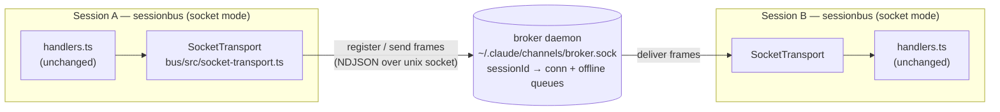

# sessionbus — Broker Daemon (Socket Transport) Design

> Spec for Goal 3 of `HANDOFF.md`: a real-time broker transport behind the existing
> `Transport` interface, plus the daemon lifecycle to run and manage it. Written
> brainstorm → design; the implementation plan follows separately.

## Summary

Today sessionbus delivers messages through a **flat-file mailbox** (`bus/src/mailbox.ts`):
each session watches its own inbox directory with `fs.watch` + a ~1s poll. That works with
zero infrastructure but caps delivery latency at the poll interval and gives no live presence.

This design adds a **broker daemon** — one long-lived process per machine, listening on a
unix domain socket — and a **`SocketTransport`** client that implements the *unchanged*
`Transport` interface. When a session runs in socket mode, its sessionbus connects to the
broker, registers its sessionId, and sends/receives message bodies over the socket in real
time. The broker routes by sessionId and holds an in-memory queue for peers that are offline.

The broker is a **dumb router**: it never parses identity, never reads `~/.claude/sessions`.
Clients resolve a `to` string → recipient sessionId(s) locally using the existing, unchanged
`address.ts` + registry, then hand the resolved sessionId to the transport. The broker only
routes by sessionId. This is a **transport swap** — everything above the `Transport` interface
(`handlers.ts`, discovery, `whoami`/`list_peers`/`send_message` resolution, beacons) is untouched.

## Locked design decisions

These were settled during brainstorming; the rest of the spec assumes them.

| # | Decision | Choice | Consequence |
| - | -------- | ------ | ----------- |
| 1 | Broker language | **TypeScript / Node** (`node:net`, NDJSON, no build step) | One toolchain, shares the repo's Node 25 native-`.ts` model. |
| 2 | Ownership | **Externally managed** — started via a `sessionbus broker` command | No self-election/auto-spawn; the operator runs it (foreground or background daemon). |
| 3 | Socket role | **Real message bus** — broker routes bodies over the socket | Message body does not touch disk on the hot path. |
| 4 | Transport selection | **Machine-wide mode** via `SESSIONBUS_TRANSPORT=socket\|file` (default `file`) | Every session on the machine agrees on transport; no per-message hedging. |
| 5 | Broker unreachable | **Stay on socket** — buffer outbound + reconnect with backoff | No silent fallback to file → no split-brain window. |
| 6 | Queue durability | **In-memory queues**, dropped on broker restart | Simplest broker; narrow loss window (see Error Handling). Disk persistence is a follow-up. |

### Why these fit together

Decisions 4 + 5 are the pair that eliminates split-brain. Because the mode is fixed
machine-wide at launch (`SESSIONBUS_TRANSPORT`) **and** a socket-mode session never silently
switches to the file backend when the broker is down (it buffers and retries instead), every
socket-mode session is unambiguously reachable through exactly one transport. A session started
while the broker was down is still a socket-mode session — it just has a pending connection —
not a file-mode session that its peers can't see.

Decision 6 is acceptable precisely because of decision 5: a client's **own** outbound survives a
broker bounce (it buffers locally and flushes on reconnect). The only exposure is a message the
broker already **accepted and queued for an offline peer** at the instant the broker dies. That
is a narrow window and a broker restart is an operator action; disk-backed queues (D2) are a
documented hardening follow-up, not part of this build.

## Architecture



- Exactly **one** broker per machine, bound to `~/.claude/channels/broker.sock`.
- Each socket-mode sessionbus is a **client**: it connects, sends a `register` frame with its
  sessionId, then sends/receives message frames.
- The broker keeps `sessionId → connection` plus a per-sessionId in-memory queue for offline peers.
- Discovery/presence (`list_peers`, `address.ts` resolution) continues to use the registry
  (`~/.claude/sessions/*.json`) ∩ presence beacons, **exactly as today**. Socket mode does not
  change how peers are discovered — only how a resolved message is transported. Broker-owned
  presence (a `peers` frame answered from the live connection table) is a possible future
  enhancement, explicitly out of scope here.

## Wire protocol

Newline-delimited JSON (NDJSON): one JSON object per line, `\n`-terminated. The codec buffers
partial input until a newline, tolerating frames split across socket chunks (and skipping an
unparseable line rather than crashing — mirroring the file mailbox's partial-write tolerance).

Frames (`broker/src/protocol.ts` is the single source of truth for these types):

```ts
// client → broker
type RegisterFrame = { type: 'register'; sessionId: string; protocolVersion: number }
type SendFrame     = { type: 'send'; to: string; msg: ChannelMessage }   // `to` is a resolved sessionId

// broker → client
type DeliverFrame  = { type: 'deliver'; msg: ChannelMessage }
type WelcomeFrame  = { type: 'welcome'; protocolVersion: number }        // sent on successful register

type Frame = RegisterFrame | SendFrame | DeliverFrame | WelcomeFrame
```

Notes:

- **Single-recipient `send`.** Broadcast fan-out (epic) already happens in `handlers.sendMessage`,
  which loops recipients and calls `transport.send(sessionId, msg)` once each. So the broker only
  ever sees single-recipient `send` frames; it does not need to understand groups.
- **`ChannelMessage`** is the existing type from `bus/src/message.ts`, serialized as-is.
- **`protocolVersion`** lets a future broker reject/negotiate an incompatible client. For this
  build the broker checks equality and replies `welcome`; a mismatch is logged and the connection
  closed (client treats it like any disconnect and retries — a version-mismatch *retirement*
  handshake, where a new client can retire an old broker, is a follow-up).

## Components

### New — `broker/` (the daemon; owns the wire protocol)

| File | Purpose | Purity |
| ---- | ------- | ------ |
| `broker/src/protocol.ts` (+ `.test`) | Frame types + NDJSON encode / streaming decode (partial-frame buffering) | pure |
| `broker/src/broker.ts` (+ `.test`) | Router / queue core: register, route-to-connected, queue-for-offline, flush-on-register, replace-on-duplicate-register, cleanup-on-disconnect | pure-ish (a `Conn` abstraction, no real socket) |
| `broker/src/server.ts` (+ `.test`) | `node:net` server + lifecycle: bind socket, reclaim a stale socket, single-instance, signal cleanup | I/O |
| `broker/src/daemon.ts` (+ `.test`) | Background daemon control: `start` (detach), `stop`, `status`, `restart`; pid/log file management | I/O |
| `broker/src/index.ts` | `sessionbus broker [start\|stop\|status\|restart\|--foreground]` CLI entrypoint (glue) | I/O (no unit test) |

**Router core (`broker.ts`) is the testable heart.** It is written against a small `Conn`
interface (`{ id?: string; send(frame): void; close(): void }`) so the whole routing/queueing
state machine is unit-tested with a fake connection — no sockets, no timers:

```ts
interface Conn { send(frame: Frame): void; close(): void }

interface BrokerCore {
  onRegister(conn: Conn, sessionId: string): void   // map sessionId→conn; flush its queue; replace+move queue if dup
  onSend(from: Conn, to: string, msg: ChannelMessage): void  // deliver if connected, else enqueue (bounded)
  onDisconnect(conn: Conn): void                    // drop the sessionId→conn mapping (queue persists in memory)
  connectedCount(): number
}
```

`server.ts` owns the actual `net.Server`: it wraps each socket in a `Conn` (buffered NDJSON
writer + streaming decoder) and forwards decoded frames to `BrokerCore`.

### New — `bus/` (the client; implements the existing `Transport`)

| File | Purpose |
| ---- | ------- |
| `bus/src/socket-transport.ts` (+ `.test`) | `createSocketTransport(socketPath)` → `Transport`. |
| `bus/src/transport.ts` (+ `.test`) | `createTransport(...)` factory: reads `SESSIONBUS_TRANSPORT` (default `file`) and returns the file or socket transport. |

`SocketTransport` maps onto the existing `Transport` interface (`{ send, poll, watch }`) with no
interface change:

- **`send(recipientSessionId, msg)`** — enqueue a `send` frame to an in-memory outbound buffer and
  write it if connected. While disconnected the buffer holds frames (bounded; see Error Handling)
  and is flushed on reconnect. Stays synchronous / `void`, matching the interface.
- **`watch(ownSessionId, onMessage)`** — connect to the socket, send `register`, call `onMessage`
  for every `deliver` frame, and reconnect with capped exponential backoff on drop. Returns a
  `stop()` that closes the connection and cancels reconnection. This is where the connection
  lifecycle lives.
- **`poll(ownSessionId)`** — no-op returning `[]`. Delivery is push-driven; `poll` exists only for
  the file backend's interface contract.

### Changed — one line in `bus/src/index.ts`

```ts
// before
const transport = createFileMailbox(CHANNELS_HOME)
// after
const transport = createTransport({ channelsHome: CHANNELS_HOME, socketPath: BROKER_SOCK })
```

`handlers.ts` and the rest of `index.ts` are **unchanged**. The factory is the only wiring change.

### `protocol.ts` sharing

`broker/src/protocol.ts` is the single source of truth for the frame types and codec. The client
(`bus/src/socket-transport.ts`) imports it via a relative `.ts` path
(`../../broker/src/protocol.ts`), which resolves under Node 25 native type-stripping with
`allowImportingTsExtensions`. This keeps the two sides from drifting; the coupling is one small,
stable file. (Rejected alternative: duplicating the ~30-line frame types in `bus/` — avoids the
cross-directory import but risks silent protocol drift.)

## Transport selection

`createTransport()` reads `SESSIONBUS_TRANSPORT`:

- **unset or `file`** (default) → `createFileMailbox(channelsHome)` — today's behavior, unchanged.
- **`socket`** → `createSocketTransport(socketPath)`.

Socket mode is turned on machine-wide by setting `SESSIONBUS_TRANSPORT=socket` in the user-level
MCP registration `env` block (`~/.claude.json` → `mcpServers.sessionbus.env`), so every spawned
session inherits it. Anyone who does not opt in keeps the file backend; nothing about the current
default path changes.

## Broker lifecycle & daemon control

The broker is externally managed (decision 2), and must be runnable as a **background daemon**, not
only in the foreground. `sessionbus broker` is a small command group. Single-instance is ultimately
enforced by the socket bind; a pid file makes `stop`/`status` clean.

| Command | Behavior |
| ------- | -------- |
| `sessionbus broker` *(or `--foreground`)* | Run in the foreground; logs to stderr. `Ctrl-C` / SIGTERM → close socket, unlink socket + pid, exit 0. |
| `sessionbus broker start` | **Detached background daemon.** `spawn` the foreground entry with `{ detached: true }`, redirect stdio → `~/.claude/channels/broker.log`, `.unref()`, write `~/.claude/channels/broker.pid`, return immediately. Refuses if already running (socket live **or** pid alive). |
| `sessionbus broker stop` | Read `broker.pid`, send SIGTERM, wait for exit, remove pid + socket. |
| `sessionbus broker status` | Report running / not, socket path, pid + liveness, connected-peer count. |
| `sessionbus broker restart` | `stop` then `start`. |

Reuse and conventions:

- **Liveness** uses the same pid-alive check as `registry.ts` (`isPidAlive`) rather than a new one.
- **File locations** live under the existing `~/.claude/channels/` root: `broker.sock`,
  `broker.pid`, `broker.log`. Pid/socket bookkeeping is atomic-written (`.tmp` + `renameSync`),
  matching how beacons and mailbox messages are written.
- **Stale-socket reclaim:** on bind, if `broker.sock` exists, connect-probe it; `ECONNREFUSED`
  (or a dead pid) means a crashed predecessor → unlink and rebind. A live listener means another
  broker is already running → refuse to start.

An **optional launchd plist** (macOS login service: start at login, respawn on crash) is the
truly set-and-forget layer. It is a **documented follow-up**, not part of this build — the
`start`/`stop`/`status`/`restart` commands already provide background operation without depending
on launchd.

## Error handling

- **Connection drop / broker down (client)** → reconnect with capped exponential backoff. Outbound
  `send` frames buffer in memory while disconnected (decision 5) and flush on reconnect. The buffer
  is **bounded**; on overflow the oldest frames are dropped with a stderr warning (a stalled broker
  must not grow client memory without bound).
- **Malformed / partial frame** → the streaming decoder buffers until a newline; an unparseable
  line is skipped, not fatal (mirrors `mailbox.poll` skipping a partially-written file).
- **Duplicate `register`** for a sessionId (reconnect before the old socket's `onDisconnect` fired)
  → the broker replaces the mapping with the new connection and **moves the pending queue** to it,
  then flushes.
- **`send` to an unconnected sessionId** → queued in memory keyed by sessionId (bounded per queue;
  overflow drops oldest with a broker-log warning), flushed when that sessionId registers.
- **Broker restart** → clients reconnect, re-register, and flush their buffered outbound. Per
  decision 6, broker-side queues held for offline peers at the moment of the crash are lost
  (recoverable only by the sender resending). Documented; D2 (disk persistence) removes this.
- **Version mismatch** on `register` → broker logs, sends nothing / closes; client treats it as a
  disconnect and retries. (Active broker *retirement* on version bump is a follow-up.)

## Testing (vitest, matching the repo)

- **`protocol.test.ts`** — encode/decode round-trip; a frame split across two chunks reassembles;
  an unparseable line is skipped without dropping following frames.
- **`broker.test.ts`** — router/queue core against a fake `Conn`: register→route-to-connected;
  send-to-offline enqueues; register flushes the queue in order; duplicate register replaces the
  conn and moves the queue; disconnect drops the mapping but preserves the queue; bounded-queue
  overflow drops oldest.
- **`server.test.ts`** — bind a broker on a temp socket path; stale-socket reclaim
  (`ECONNREFUSED` → rebind); SIGTERM cleanup removes socket.
- **`socket-transport.test.ts`** — **integration** against a real in-process broker over a temp
  unix socket: two clients exchange a message; offline-queue-then-register flushes; a forced
  disconnect triggers reconnect and the buffered outbound flushes; `stop()` cancels reconnection.
- **`transport.test.ts`** — factory returns file vs socket per `SESSIONBUS_TRANSPORT`.
- **`daemon.test.ts`** — `start` writes a pid + detaches; `status` reflects running/stopped;
  `stop` SIGTERMs and cleans up; `start` refuses when already running.

`pnpm exec tsc --noEmit` stays clean; new tests add to the existing 47. Constraints hold: no
`enum`/`namespace`/decorators/param-properties, no `any`, atomic writes for shared on-disk state.

## Scope

**In scope (this build):**

- `broker/` daemon: `protocol.ts`, `broker.ts`, `server.ts`, `daemon.ts`, `index.ts` + tests.
- `bus/` client: `socket-transport.ts`, `transport.ts` factory + tests; the one-line `index.ts` swap.
- Daemon control: foreground + `start` / `stop` / `status` / `restart` with pid/log/socket files.
- Proof: two sessions exchanging messages over the socket, including offline-queue delivery.

**Out of scope (documented follow-ups):**

- **D2** disk-persisted broker queues (survive broker restart).
- **launchd** plist for login auto-start / crash respawn.
- Broker-owned **presence** (`peers` frame from the live connection table) replacing beacon reads.
- Active **version-mismatch retirement** (a new client retiring an old broker on code change).

## Suggested build order

1. `protocol.ts` (+tests) — the shared contract, no I/O.
2. `broker.ts` router core (+tests) — the state machine against a fake `Conn`.
3. `server.ts` (+tests) — wrap the core in a real `net.Server` with lifecycle.
4. `socket-transport.ts` (+tests) — client implementing `Transport`, integration-tested against
   the real server from step 3.
5. `transport.ts` factory (+tests) and the `bus/src/index.ts` one-line swap.
6. `daemon.ts` + `broker/src/index.ts` CLI — background daemon control.
7. Two-session end-to-end proof; update `README.md`.
