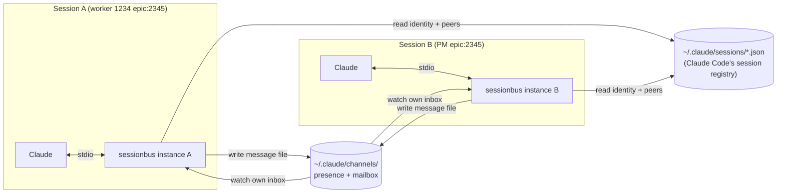

# sessionbus — a channel MCP server that connects Claude Code sessions

**Status:** Design (approved for planning)
**Date:** 2026-07-15
**Author:** Samer Ziade (brainstormed with Claude)

## Summary

`sessionbus` is a [Claude Code channel](https://code.claude.com/docs/en/channels-reference)
— an MCP server, spawned per session over stdio, that lets separate Claude Code
sessions on the same machine send messages to each other. A session **sends** by
calling a tool; it **receives** as a `<channel>` event injected into its context,
which drives a turn even when the session is otherwise idle.

The immediate motivation is the PM/worker epic workflow: a worker session
(named e.g. `1234 epic:2345`) can notify its PM session (named `epic:2345`) that an
OpenSpec is ready to review, or relay a blocking question. But the design is
deliberately **general** — any session can discover and message any other; the
epic/PM concepts are a convenience layer, not a restriction.

## Goals

- Any Claude Code session running the server can **discover** other such sessions
  and **send** a message that arrives in the target's context.
- **Identity is derived from the session's title** (`epic:2345`, `1234 epic:2345`),
  with no manual registration step.
- Routing is **flexible and AI-driven**: the model sees who is reachable and decides
  who to message. `pm` / `epic` broadcast are sugar over generic session addressing.
- **Zero-friction runtime**: pure Node, no native dependencies, no build step, no
  long-lived daemon to supervise.
- Usable **outside** the epic workflow (sessions with arbitrary names still
  participate as first-class peers).

## Non-goals (explicit future work)

- **Permission relay** (`claude/channel/permission`) — forwarding tool-approval
  prompts between sessions. Clean add-on later.
- **Milestone message types / templates** ("openspec ready", "question for human",
  "review requested"). MVP ships a generic free-text message; typed events layer on top.
- **A broker daemon.** Considered and deferred (see Alternatives). The transport is
  isolated behind an interface so a daemon is a drop-in swap if we ever want
  real-time presence events.
- **Cross-machine** messaging. Single-host only.

## Background: how channels work

A channel is an MCP server Claude Code spawns as a stdio subprocess. It:

1. Declares the `claude/channel` capability so Claude Code registers a notification
   listener.
2. Emits `notifications/claude/channel` events (`content` + string-only `meta`) that
   arrive wrapped as `<channel source="…" …attrs…>content</channel>`.
3. Optionally exposes standard MCP **tools** (via `tools: {}` capability) so Claude
   can send data back out — this is what makes a channel two-way.

Key consequence for this project: **each session spawns its own instance** of the
server. Two sessions' instances cannot talk directly — they must coordinate through
shared state on disk.

## Architecture

Two on-disk mechanisms do all the coordination; there is no network service and no
daemon.



### Discovery — the session registry

Claude Code already maintains a live registry: one JSON file per running session at
`~/.claude/sessions/<pid>.json`, e.g.

```json
{
  "pid": 60835,
  "sessionId": "40b1b2a0-faee-4aa6-aa2c-a56535b547dd",
  "cwd": "/Users/samer/github/styreo/main",
  "name": "main-8d",
  "nameSource": "derived",
  "status": "busy",
  "updatedAt": 1784157712199
}
```

Combined with the `CLAUDE_CODE_SESSION_ID` env var (present in every spawned
subprocess), this is a complete discovery surface: a server finds **its own** entry
by matching `sessionId`, and enumerates **all** entries to see peers, their names,
`busy`/`idle` status, and `cwd`. When a session is renamed to `epic:2345`, its `name`
here updates. The registry is Claude Code's own artifact — we only read it.

### Identity — parsed from the session name

On startup the server resolves its own identity from its registry `name`:

| Name pattern           | role     | fields                 |
| ---------------------- | -------- | ---------------------- |
| `^epic:(\d+)$`         | `pm`     | `epic = N`             |
| `^(\S+)\s+epic:(\d+)$` | `worker` | `issue = $1, epic = N` |
| anything else          | `none`   | — (still a full peer)  |

`role: none` sessions participate fully; they just lack the `pm`/`epic` addressing
sugar. This is what makes the tool useful beyond the epic workflow.

### Presence beacon

The registry lists sessions, but not whether a given session actually loaded the
channel. So each server also writes a beacon on startup:

```text
~/.claude/channels/present/<sessionId>.json   # { sessionId, pid, name, epic, role, startedAt }
```

It refreshes the beacon's mtime periodically and removes it on clean exit. Peer
liveness = `registry entry exists` ∩ `beacon exists` ∩ `pid alive`
(`process.kill(pid, 0)`). Stale beacons (dead pid) are pruned lazily on read.

### Transport — the flat-file mailbox

```text
~/.claude/channels/
  present/<sessionId>.json                 # presence beacons (above)
  bus/<recipientSessionId>/<id>.json       # one message = one file
  bus/<recipientSessionId>/consumed/<id>.json  # archived after delivery
```

- **Send** = write a message file into the recipient's inbox directory. Writes are
  atomic: write `.<id>.tmp`, then `rename` to `<id>.json` (rename is atomic on the
  same filesystem, so a reader never sees a partial file).
- **Receive** = each server watches **its own** inbox with `fs.watch`, plus a ~1s
  poll as a fallback (macOS `fs.watch` can miss events). On a new file: validate JSON,
  emit the channel notification, then move the file to `consumed/`.
- **Broadcast** (`to: epic`) = the sender enumerates the epic's live members from the
  registry∩presence (excluding itself) and writes one copy into each member's inbox.
- **Delivery semantics:** at-least-once. An in-memory `Set` of delivered ids
  suppresses duplicate `fs.watch` fires; moving to `consumed/` prevents re-delivery
  across restarts. Messages persist on disk, so a busy or briefly-down target simply
  receives them on its next turn / next start.

Message file schema:

```json
{
  "id": "m8f2k1-9a3c7e",
  "from": { "sessionId": "…", "name": "1234 epic:2345", "epic": "2345", "role": "worker" },
  "to":   { "kind": "session", "value": "<recipientSessionId>" },
  "text": "can you review the openspec I just pushed for #1234?",
  "createdAt": 1784157712199
}
```

`id` is a sortable, dependency-free identifier: `base36(createdAt)` + random suffix.

## Tools (the send surface)

The server declares `tools: {}` and exposes three:

### `list_peers({ scope?: "epic" | "all" })`

Returns reachable peers so Claude can decide who to message:

```json
[
  { "sessionId": "…", "shortId": "ab12cd", "name": "epic:2345",
    "epic": "2345", "role": "pm", "status": "idle", "cwd": "…", "lastSeen": 1784… }
]
```

`scope: "epic"` (default when the caller is in an epic) filters to the caller's epic;
`scope: "all"` lists every reachable session. Excludes self.

### `send_message({ to, text })`

`to` is resolved flexibly against the registry/presence:

| `to` value                 | resolves to                              |
| -------------------------- | ---------------------------------------- |
| full/short `sessionId`     | that specific session                    |
| `"pm"`                     | the PM (`role: pm`) of the caller's epic |
| `"epic"` / `"epic:N"`      | broadcast to that epic's live members    |
| a session `name` substring | the matching session, if unambiguous     |

If a name/alias is ambiguous or unresolved, the tool returns the candidate list (or
an empty-match error) so Claude can retry with a precise id — it never silently
guesses. Returns a per-recipient delivery summary (how many inboxes were written).

### `whoami()`

Returns the caller's parsed identity (`sessionId`, `name`, `role`, `epic`, `issue`),
so Claude can reason about itself when composing/routing messages.

## Message format on arrival

An inbound message is delivered as:

```text
<channel source="sessionbus" from="1234 epic:2345" from_id="ab12cd"
         epic="2345" role="worker" msg_id="m8f2k1-9a3c7e">
can you review the openspec I just pushed for #1234?
</channel>
```

`meta` keys are identifier-safe (letters/digits/underscore) per the channel contract
— hyphenated keys are silently dropped, so we use `from_id`, `msg_id`, etc.

## Instructions string (system-prompt guidance)

The `Server` `instructions` teach Claude the model, roughly:

> Messages tagged `<channel source="sessionbus" …>` are from **another Claude Code
> session** on this machine. Use `list_peers` to see reachable sessions and
> `send_message` to reach one. `to` accepts a session id, a name, `pm` (the PM of your
> epic), or `epic` (broadcast to your epic). When you receive a message, decide
> whether to act on it or reply via `send_message` back to `from_id`. Sessions named
> `epic:<n>` are PMs; `<issue> epic:<n>` are workers — these are conventions to help
> you route, not hard rules.

## Runtime, packaging & registration

- **Location:** `tools/sessionbus/` in this repo (personal cross-project tooling for
  now; will likely graduate to its own repo later).
- **Runtime:** pure Node. Only dependency is `@modelcontextprotocol/sdk`. Node ≥ 23.6
  runs TypeScript directly via native type-stripping (the machine is on Node 25), so
  there is **no build step** — the MCP config points `node` at the `.ts` entrypoint.
  A compiled fallback is trivial if ever needed.
- **Structure** (transport behind an interface for testability + future daemon swap):

  ```text
  tools/sessionbus/
    package.json
    src/
      index.ts        # MCP server wiring: capabilities, tools, notifications, watch loop
      identity.ts     # env + registry → own identity; name parsing
      registry.ts     # read ~/.claude/sessions/*.json, presence beacons, liveness
      mailbox.ts      # Transport interface + flat-file implementation (send/watch/consume)
      address.ts      # resolve `to` → recipient sessionId(s)
      message.ts      # schema, id generation, <channel> meta mapping
    src/*.test.ts     # unit + integration tests
  ```

- **MCP registration** (user-level, so every session loads it) in `~/.claude.json`:

  ```json
  {
    "mcpServers": {
      "sessionbus": { "command": "node", "args": ["/Users/samer/github/styreo/main/tools/sessionbus/src/index.ts"] }
    }
  }
  ```

- **Configurable roots** via env for testing: `CHANNELS_HOME` (default
  `~/.claude/channels`) and `SESSIONS_DIR` (default `~/.claude/sessions`).

### Setup constraint (research preview)

Channels are a research preview, so each session must be launched with:

```bash
claude --dangerously-load-development-channels server:sessionbus
```

Practical implications, to be handled as part of adoption (not in the server itself):

- A shell alias (e.g. `claude-ch`) for normal interactive sessions.
- The **spawn path for PM/worker sessions** (`implement-issue` and however PMs are
  started) must include the flag so those sessions get the channel. This is a
  follow-up wiring task, tracked separately from the server implementation.

## Edge cases & decisions

- **Non-epic sessions**: fully participate as `role: none` peers; addressable by id or
  name; excluded only from `pm`/`epic` sugar.
- **Self-messaging**: suppressed — a session never delivers to its own inbox
  (including broadcasts).
- **Target offline**: message waits on disk; delivered when the target next starts and
  scans its inbox. `send_message`'s summary reflects that it was written, not yet read
  (delivery is fire-and-forget per the channel contract; there is no read receipt in
  the MVP).
- **Duplicate `fs.watch` events**: suppressed by the in-memory delivered-id set.
- **Crash mid-consume**: file already moved to `consumed/` → not re-delivered; file
  not yet moved → re-delivered on next scan (at-least-once, dedup by id).
- **Trust boundary**: all peers are the same OS user's local sessions reading a
  user-owned directory. Inbound text is wrapped as `<channel>` data, but it originates
  from another Claude session and could contain instruction-like content; for the MVP
  this is accepted (same-user, single-host). Sender gating (the contract's allowlist
  pattern) is unnecessary here and is noted as a future hardening if the surface ever
  widens.

## Testing

- **Unit** (pure, no MCP): `identity.ts` name parsing (all three patterns + junk);
  `address.ts` resolution (id / `pm` / `epic` / name / ambiguous / unresolved);
  `message.ts` id generation + meta mapping (hyphen-key dropping); `mailbox.ts`
  atomic write, watch-and-consume, dedup, `consumed/` archival, broadcast fan-out.
- **Integration**: two `Mailbox`/server instances against a temp `CHANNELS_HOME` with
  hand-authored registry + presence fixtures; assert a `send_message` from A produces
  the expected `notifications/claude/channel` on B (spy on the notification method).
  Cover offline-then-deliver-on-start and broadcast-to-N.

## Alternatives considered

- **Central broker daemon (unix socket).** Real-time push and a single source of
  truth, but the *code* is the easy part; the lifecycle is not — startup races when
  many workers launch at once, crash recovery + client reconnect, version handshakes
  on code change, and orphan reconciliation. That robustness tax buys latency
  (milliseconds vs ~1s) that human-read PM↔worker messages don't need. Deferred; the
  `Transport` interface keeps it a drop-in swap.
- **Peer-to-peer sockets.** Reinvents the discovery + queueing the registry + mailbox
  provide for free. Rejected.

## Open questions / to confirm during implementation

- Confirm `~/.claude/sessions/*.json` `name` updates promptly on an interactive rename
  (expected; `nameSource` flips to a custom value).
- Confirm a channel notification reliably drives a turn in a session that is idle
  waiting on user input (the docs' webhook walkthrough implies yes).
- Decide the presence-beacon refresh interval and stale-prune threshold (initial:
  refresh ~30s, prune on dead pid).
