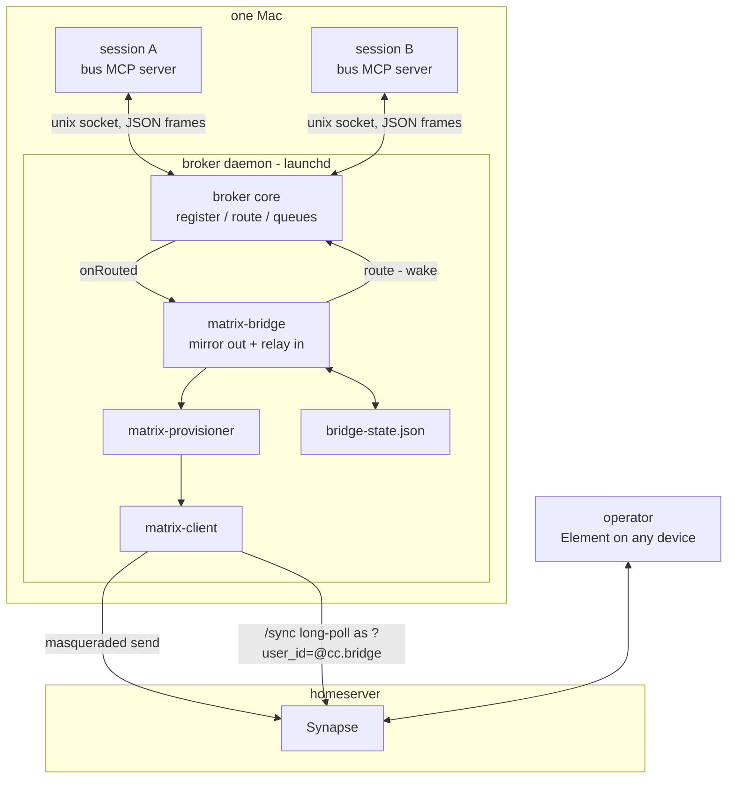
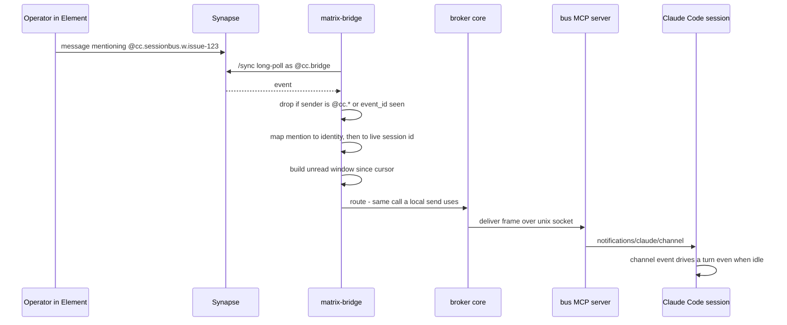

# sessionbus ⇄ Matrix bridge — design

**Date:** 2026-09-22
**Status:** approved design, not yet implemented
**Scope:** grouping sessions into persistent Matrix rooms, mirroring session traffic into them,
relaying human mentions back into sessions, and reading room history on demand.

## 1. Context

Today a session talks to another session and nothing else happens. Delivery is ephemeral: the
broker holds conns and queues in memory, a message that has been delivered is gone, and a session
that starts later has no way to learn what was said before it existed. There is also no way for a
human to take part — the only participants are MCP servers on one Mac.

Three gaps follow from that:

1. **No durable history.** A future session cannot look up what an epic decided.
2. **No human seat.** The operator cannot read the conversation as it happens, or prod a session
   from a phone.
3. **No grouping surface.** `epic:N` exists as a routing convention, but there is nowhere that an
   epic's conversation actually *lives*.

A private Matrix homeserver closes all three: it is already a durable, searchable, multi-party
message store with a good client on every device.

## 2. Goals and non-goals

**Goals**

- Every session belongs to a project and, when it has one, an epic. Each grouping has a room.
- Session-to-session traffic is mirrored into the right room, attributed to a per-session user.
- The operator can post from any Matrix client and wake a specific session by mentioning it.
- A session can read history from any of these rooms on demand.
- Local messaging keeps working, unchanged, when the homeserver is unavailable.

**Non-goals**

- Cross-machine messaging. All sessions run on one Mac; the unix-socket broker stays the local
  delivery path.
- Replacing the broker with Matrix as the transport.
- Session spawning. How a worker session is created is out of scope; this design covers grouping,
  addressing, and conversation.
- Edits, redactions, reactions, media. v1 handles `m.text` only.
- End-to-end encryption. Rooms are unencrypted, which is what makes history readable by a session
  that joins later.

## 3. Decisions

| # | Decision | Rationale |
|---|----------|-----------|
| D1 | The Matrix client lives **inside the broker process**, as a bridge module | The broker is already the one long-lived, supervised process and already owns routing. One process holds one credential, and an inbound mention converges on the same `route()` call a local send uses. |
| D2 | Matrix is a **mirror**, never the delivery path between local sessions | Local delivery stays fast and keeps working when the homeserver is down. It also makes echo loops structurally impossible: exactly one delivery path per message. |
| D3 | The bridge authenticates as a **Synapse appservice** over the `cc` namespace, registered with `url: null`, and acts as `@cc.bridge` by masquerade | One token, scoped to `@cc.*` / `#cc.*`, that can act as any user in the namespace and is exempt from rate limits. `url: null` because Synapse cannot reach this Mac. The registration's `sender_localpart` is `cc.sender`, an identity we never act as, because Synapse refuses `/sync` for an appservice's sender user (matrix-doc#1144) — so the bot is an ordinary namespace user and **every** bot call, `/sync` included, carries `?user_id=@cc.bridge:…`, the same masquerade every session user already uses. |
| D4 | One Matrix user per **work identity**, derived from the session title | Session ids are not stable — a `--resume` launch swaps the id after spawn. A title-derived identity survives restarts, so history stays attributed to "the worker for #123". |
| D5 | Rooms are created **lazily and idempotently** from a deterministic alias | No extra step in the workflow, and two sessions racing to create an epic room both land in the same room because an alias is claimed once. |
| D6 | **Only an explicit mention wakes a session** | Waking a session costs tokens and starts a turn. Everything else is history that a session can read when it decides to. |
| D7 | A wake carries the **unread window inline**, capped | A pull-only wake has a silent failure mode: the model answers without calling `read_history`, and nothing detects it. Inlining removes the failure mode; the cap bounds the cost. |
| D8 | Threads are assigned **mechanically** by the bridge, not chosen by the model | Model-chosen threading is inconsistent between sessions and spends tokens on bookkeeping. The bridge already knows who is talking to whom. |
| D9 | Bridge state is a **single JSON file with atomic writes**; Matrix is the database | Only three kinds of small, mutable bookkeeping need to survive a restart. Messages live in Synapse, which is already backed up. |
| D10 | A Matrix failure **never exits the broker** | The fail-loud contract exists so launchd restarts a broken broker. A homeserver outage is not a broken broker; local messaging is unaffected by it. |
| D11 | Configuration is **layered** — defaults, then a JSON file, then environment — resolved by a pure function | Seven new knobs and a secret do not belong in a world-readable plist regenerated by the Makefile. A pure resolver keeps precedence testable and env reads confined to the entrypoint. |

## 4. Architecture



### 4.1 New modules

All new modules live in the `broker` package, each with a paired `*.test.ts`.

| Module | Purpose | Purity |
|--------|---------|--------|
| `matrix-names.ts` | project + identity → localpart, room alias, space alias; slug rules and length limits | pure |
| `matrix-client.ts` | HTTP client for the appservice: masqueraded send, register user, create room/space, resolve alias, join, `/sync`, `/messages`. Every call takes a **required** `asUser` — registration is the only exception, since you cannot masquerade as an account you are about to create. Optional would mean an omitted actor silently acts as the idle sender and builds a room the bridge is not in; required makes that a compile error | I/O, injected `fetch` |
| `matrix-provisioner.ts` | idempotent ensure-user / ensure-room / ensure-space / ensure-member, memoized and race-safe | I/O via client |
| `matrix-bridge.ts` | outbound mirror queue and inbound relay; owns dedupe, cursors, thread map | I/O via deps |
| `bridge-state.ts` | the persisted JSON state behind a `BridgeState` interface | I/O |
| `config.ts` | defaults + file + env → a typed `Config` and a list of problems (§11) | pure |

### 4.2 Changes to existing modules

- **`broker.ts`** — an optional `onRouted(msg)` hook, invoked after `route()`, which dedupes by
  `msg.id` so one logical message produces one mirror job. The core stays unaware of Matrix.
- **`bus/handlers.ts` — a prerequisite fix.** `sendMessage` currently calls `newMessageId()`
  *inside* the fan-out loop, so today every recipient of a broadcast receives a different id.
  Dedupe by `msg.id` is therefore a no-op against the shipped code, and a three-member broadcast
  would mirror three times. The id must be minted **once per `send_message` call** and reused
  across the copies: one logical message, N deliveries. The normative spec constrains only the id's
  format and the fan-out's self-suppression, so this is a design-level addition rather than spec
  drift.
- **`broker/index.ts`** — reads the config file and environment once, resolves them through
  `config.ts`, and passes the result down. Gains a `config` subcommand that prints the resolved
  values with their source and the token redacted.
- **`protocol.ts`** — `RegisterFrame` gains `project` and `title`; new `HistoryRequestFrame` /
  `HistoryReplyFrame`.
- **`bus/handlers.ts`** — a `read_history` tool; `send_message` accepts a list `to` and an optional
  `thread`.
- **`bus/index.ts`** — the register frame carries the project and the session title. The project
  is the **repository name only**: the final path segment of the `origin` remote with one trailing
  `.git` and any trailing `/` removed, falling back to the directory's own name. Not `owner/repo` —
  that describes where we look, not what we keep — so two repositories sharing a name share a
  project, which is what the `projects` override in §11 is really for. When nothing is derivable,
  the frame announces no project and the session is not provisioned at all, rather than being
  dumped into a shared catch-all. Both fields are optional and the protocol version does **not**
  bump: `server.ts` hard-rejects a version mismatch, so bumping would make an un-upgraded `bus`
  unreachable rather than merely unprovisioned. The MCP
  `instructions` string documents the mention and catch-up conventions.

The `file` transport is untouched. Matrix requires socket mode; `read_history` on the file
transport returns `{ ok: false, reason: 'unavailable' }`.

## 5. Naming, rooms and spaces

```text
#claude                          operator-owned root space
└── #cc.<repo>                   space, per project, created lazily
    ├── #cc.<repo>.lobby         lobby room - every session in the project
    ├── #cc.<repo>.epic.42       epic room
    └── #cc.<repo>.epic.57
```

| Thing | Pattern | Example |
|-------|---------|---------|
| Project space | `#cc.<repo>` | `#cc.sessionbus` |
| Project lobby | `#cc.<repo>.lobby` | `#cc.sessionbus.lobby` |
| Epic room | `#cc.<repo>.epic.<N>` | `#cc.sessionbus.epic.42` |
| PM user | `@cc.<repo>.pm.<N>` | `@cc.sessionbus.pm.42` |
| Worker user | `@cc.<repo>.w.<issue>` | `@cc.sessionbus.w.issue-123` |
| Unstructured session user | `@cc.<repo>.s.<title>` | `@cc.sessionbus.s.planning-notes` |
| Bridge bot | `@cc.bridge` | `@cc.bridge` |

**`.` is the structural separator and can never occur inside a segment.** A slug is lowercased,
has one trailing `.git` stripped, collapses each run of characters outside `a-z0-9` to a single
`-`, and trims leading and trailing `-`. Using `-` for both jobs does not work: project `x` with
worker `w-1` and project `x-w` with worker `1` both render `@cc-x-w-w-1`, and project `foo-lobby`'s
space alias collides with project `foo`'s lobby. Escaping `-` as `--` inside segments would also
close the hole and keep hyphenated aliases, but it costs an escape rule on every read and write;
a separator that cannot appear in a segment needs no escaping at all.

**Length.** The limit is 255 bytes for the **fully qualified** id — sigil, localpart, `:` and the
homeserver domain — so the localpart budget depends on the domain and must be computed. When the
untruncated identifier exceeds it, append `.` plus the first eight lowercase hex characters of the
SHA-256 of the **untruncated localpart**, then recover space by shortening the project segment
first, never leaving it ending in `-`. The kind marker (`pm`, `w`, `s`, `epic`, `lobby`) always
survives; the discriminator gives way only as a last resort. Hashing the whole localpart rather
than the project name is what keeps two long identities that share a prefix apart. An identifier
that fits carries no hash suffix. Because the hash is a further segment and segment counts are
fixed per kind, a truncated identifier can never equal an untruncated one — the two forms are
disjoint by construction rather than by argument.

**A project whose name slugs to nothing is not a project.** It follows the same rule as a session
with no derivable project (§4.2): announce nothing, provision nothing. Minting a hash-named project
would create a room nobody can recognize in a client.

Identity comes from the session title through the existing parser: `epic:42` is a PM, `issue-123
epic:42` is a worker. `<issue>` is the slug of the token the parser captured, which is an arbitrary
non-space string — the repo's own title style yields `@cc.sessionbus.w.issue-123`, not `…w.123`.
A worker localpart is keyed on the issue alone, so the same issue worked under two epics shares one
user; the epic still separates the rooms, and one issue is one piece of work. A session whose title
matches neither pattern joins the **lobby** as `@cc.<repo>.s.<slug(title)>`. **Any** discriminator
that slugs to nothing becomes `unnamed` — a title of `...`, but equally an issue token of `---`,
which the parser accepts since it captures an arbitrary non-space string. One rule rather than two,
and it keeps every session that has a project holding exactly one identity in it — which is what lets a planning session take part. Two such sessions
sharing a title share an identity, exactly as two PMs of one epic would.

**Room properties on creation:** unencrypted, invite-only, history visibility `shared` so a later
joiner can read what came before, topic set from the epic, and the operator invited. An **adopted**
room keeps whatever settings it has: if its history visibility is not `shared`, the bot sees it only
from the moment it joins, so catch-up in a hand-made room starts there. Widening it is the
operator's call, not the bridge's.

**Space linking** requires `@cc.bridge` to hold power level 50 or higher in `#claude`. Without it,
project spaces are still created; they are simply not nested. The bridge warns once and continues.

## 6. Threading

Threads are assigned by the bridge:

- **Pair threads are the default**, created on the **first direct-message mirror** between a pair
  rather than on a join, so thread creation does not depend on the provisioning path. `rememberThread`
  is idempotent, so a join-time and a first-message path could not create two roots. The bridge posts a root event
  — `🔧 worker #123 joined: <title>` — and every direct message between that worker and its PM
  goes into that thread. Worker-to-worker pairs get their own thread, created lazily.
- **The main timeline** carries joins, epic broadcasts, and operator messages.
- **Sessions may target threads explicitly** through `send_message`:

| `thread` argument | Behavior |
|-------------------|----------|
| omitted | The thread of the most recent message this session received from that recipient, else the pair thread. This is what keeps a session that was called into a discussion answering *in* that discussion. |
| `"<handle>"` | Post into that existing thread. The handle comes from the inbound channel meta. A **malformed** handle fails with `invalid_thread` in every transport, since shape needs no round trip. An unresolvable one fails with `thread_not_found` **where the transport can answer synchronously** — a silent redirect would deliver a typo into the wrong conversation with no signal. |
| `{ new: "<title>" }` | The bridge posts a titled root event and starts a new thread. |

**The resolution check is staged, because `send_message` is synchronous in the `bus` process while
thread state lives in the broker.** Over the socket transport nothing can resolve a handle at call
time, so the message is delivered locally and its mirror posts to the destination room's **main
timeline** — never another thread — with the mismatch logged. Dropping the mirror instead would
punch a hole in history for something the operator can neither see nor recover, whereas the
timeline is the neutral place rather than a wrong one. The synchronous failure becomes available in
every mode once the relay change adds its request/reply frame (§8.3), which is what makes this a
staged guarantee rather than a permanent gap.

A thread handle (`t_9f2a`) is a short, stable alias for the root `event_id`, mapped in bridge
state. Handles keep meta small and readable and avoid putting raw event ids in a transcript.

Any participant — a session or the operator — can mention other sessions inside a thread to pull
them into the discussion.

## 7. Data flow

### 7.0 Bridge start

Before any provisioning, the bridge ensures its own bot user exists. The appservice token is
permitted to act as `@cc.bridge`, but Synapse does not create that account — `whoami` succeeding
proves the permission, not the account, and that exact misreading once hid this step. So the bridge
registers the bot idempotently (`M_USER_IN_USE` is success). **It never sets the bot's display
name**: that name is the operator's (`Claude Code Bridge`), and a daemon that overwrites a name a
human chose is the same class of rudeness as reconciling an adopted room's settings. Provisioning does not begin until this succeeds, since every room is created as the
bot. A failure is a bridge failure — retried with backoff, never fatal to the broker (D10), never
memoized as failed — **except an authentication refusal**, which stops the retries and leaves
provisioning off, per §12's rule that a 401/403 is not transient and must never spin. Sessions that
register while the bootstrap is outstanding wait rather than being provisioned ahead of the bot or
dropped. The bot's display name is left alone entirely (above).

**No diagnostic may use `whoami` as an existence check.** A `doctor` "token valid" check built on it
would pass on exactly the broken homeserver that surfaced this step. Registration's own
`M_USER_IN_USE` is the existence check.

**The bridge can be switched off by two routes** — invalid configuration (§11) and an authentication
refusal here — and they converge on one disabled state that carries its reason, so `broker config`
and `doctor` report *why* the bridge is off rather than only that it is. Owned by the configuration
change.

Session users are registered the same way before they join anything. Both use
`m.login.application_service` with `inhibit_login: true`: everything goes through the appservice
token by masquerade, so a login would only mint devices that accumulate for nothing.

### 7.1 Session registers

The broker binds the conn immediately; local delivery never waits on Matrix. In the background the
provisioner ensures the user exists and its display name matches the session title, ensures the
project space and lobby, links the space under `#claude`, ensures the epic room when the session
has an epic, joins the user to both, **joins the bridge bot `@cc.bridge` to every room and space it
creates or adopts**, and invites the operator to any room it **creates** — an
adopted room gets no invite, so an operator who deliberately left is not dragged back in on every
restart. The display name is updated only when the title differs from the one last set **in this
run**; the last-set name is memory-only, since re-setting it once per restart is cheaper than a
fourth persisted row. **Rooms and spaces are created as `@cc.bridge` itself**, which then invites the session users and
the operator. Every room is invite-only, and a masqueraded session user cannot join an invite-only
room it was never invited to — so something has to send those invites, and the room's creator is
the member with the power to do it. Creating as a session user instead would leave the bot to be
invited and joined afterwards (two extra requests, and a window where the room exists without it),
and would hand the room's top power level to an identity that may never register again.

The bridge bot's membership is not optional bookkeeping: with `url: null` Synapse pushes nothing,
and `/sync` returns events only from rooms the syncing user has joined. A room without the bot is a
room whose mentions are never seen — silently, since every other layer still works. One syncing
bot is preferred over syncing as each session user, which would mean one long-poll per identity.
Ensuring the bot's membership is idempotent and applies to adopted rooms too, alongside the rule
that an adopted room's settings are otherwise trusted as-is; a failed bot join fails the ensure
rather than being swallowed.

The broker keeps an identity → current session id map for inbound routing,
**rebuilt** on every registration and cleared on disconnect — a cached map would route a wake to a
discarded session id, which is the same silent-loss shape as a beacon disagreeing with its
subscription.

If at least one message **mentioning** the identity arrived since its cursor, registering produces
a single catch-up wake per such room — never a replayed burst. Unread messages that mention nobody
are history, not a wake (D6); an identity with missed mentions in two rooms gets two wakes, because
a wake's meta names exactly one room and carries exactly one window.

### 7.2 Session to session

`route()` delivers locally exactly as today. `onRouted` then queues a mirror job:

| Message kind | Room | Mentions |
|--------------|------|----------|
| Direct | The pair's shared epic room — same project, same epic — else the sender's lobby | the recipient |
| Epic broadcast | The epic room | `m.mentions.room` |
| List `to` | One event: the shared epic room when every recipient shares it, else the sender's lobby | each recipient named individually |

A list that mixes an epic-broadcast target with named recipients fails with `mixed_kind` rather
than being silently reinterpreted.

Posted as the sender's user, ordered per room, retried with backoff, with `msg.id` as the Matrix
`txnId` so retries are idempotent and a fanned-out broadcast becomes exactly one event. That last
property depends on the prerequisite fix in §4.2: the copies must share one id.

**A cross-project direct message mirrors into the sender's lobby, which the recipient may not be
a member of.** Local addressing is project-agnostic — a full session id, a short-id prefix or a
name substring all resolve across projects — so the pair may share no room at all. Delivery is
unaffected, since the broker routes it locally; only the mirror is one-sided, and the sender's
project keeps the record. Cross-project membership is deferred (§16).

**A broadcast with no live recipients is not mirrored.** `resolveTo` filters an epic broadcast
against live peers, so with nobody live there is nothing to route, `onRouted` never fires, and the
room records no attempt. This is accepted for v1: the mirror reflects delivery, not intent.

### 7.3 Operator to session



Matrix adds exactly one new hop. Everything from the `deliver` frame onward is code that already
ships.

**A half-masqueraded relay is the failure to guard against, not an unmasqueraded one.** An
unmasqueraded `/sync` fails loudly with a 500. Syncing as the bot while *joining* as the sender
would succeed at both calls and produce a room the stream cannot see — presenting as "the invite
was accepted but nothing ever wakes". That is why every request made as the bot carries the
masquerade, not only `/sync`.

**A mention in the root space can wake a session.** The operator invited the bot there, the relay
reads every room the bot has joined, and the space is outside the `cc` namespace but inside the
operator's control. No rule excludes it: in practice a client does not offer a space as a place to
chat, so the case is theoretical, and an extra filter rule would cost more than it protects.

**An event naming several identities is deduplicated once by `event_id` and then fans out to one
wake per named identity**, each built from that identity's own cursor and carrying its own
`msg_id`. A shared wake would impose one identity's `unread` and `since` on everyone and be wrong
for all but one of them. Each wake's `mentions` lists the *other* identities the event named, never
the recipient itself.

### 7.3.1 Invites to the bridge bot

The homeserver has server-wide auto-accept off, and with `url: null` nothing pushes an invite to the
bridge, so an invite to `@cc.bridge` stays pending until the bridge joins it. The relay handles the
`rooms.invite` section of the bot's own `/sync` stream: **an invite from the configured operator is
accepted** by joining as the bot, and **any other invite is declined**.

Operator-only is a security rule, not a convenience. The relay wakes sessions on mentions in any
room the bot belongs to, so accepting every invite would let any account on the homeserver get the
bot into a room it controls and drive Claude sessions from there. Federation being off does not
help — the risk is local accounts. It is the same reasoning that keeps the homeserver's own
auto-accept off, applied one level down.

Acceptance is idempotent across a replayed batch. **Every start, warm or cold, begins with one
initial sync requesting an empty timeline** and handles its `rooms.invite`; a cold start takes its
"now" position from that response, a warm start discards it and resumes from the saved position.
The warm case is the one that bites: an incremental sync reports a membership change only in the
batch where it happened, and the position is saved after each batch, so an operator invite whose
join failed just before a restart would otherwise be gone for good. For the same reason a failed
join is retried from an in-memory set of pending rooms rather than by waiting for the invite to
reappear, and retrying stops when the room shows up under `rooms.leave`.

**With no operator configured, the relay accepts nothing and declines nothing.** Declining would
destroy the operator's own pending invites while the configuration is broken; leaving them pending
lets the next correctly configured start pick them up. The initial-sync behavior above is standard
homeserver behavior but not something a fake `fetch` can prove, so it is on the live smoke
checklist (§13).

**The bot's stream carries only the bot's own invites.** An invite addressed to a session user never
appears in it, and seeing those would take one sync stream per identity, which §7.1 rejects. Session
users' membership is therefore managed entirely by the provisioner, which creates rooms as the bot
and invites and joins session users itself, leaving nothing pending. A human inviting a session
user into an arbitrary room is unsupported in v1 (§16).

The rollout order that follows: the operator invites `@cc.bridge` to `#claude`, the bridge joins on
its next sync, and only then can its power level be raised.

### 7.4 Session to operator

A `to` that is a non-`cc` Matrix id (`@samer:…`) skips local routing and becomes a Matrix-only
post, addressed to the room and thread of that person's most recent mention of this session. When
that person has never mentioned it, **or the remembered room is one the session no longer belongs
to**, the post falls back to the session's own room — its epic room, else its lobby — on the main
timeline. That fallback is what enforces §8.3's write restriction without a separate permission
check.

## 8. The wake payload

### 8.1 Contract

Channel meta keys must be identifier-safe, and every key costs tokens on every wake, so the set is
deliberately small.

| Key | Example | Why the model needs it |
|-----|---------|------------------------|
| `from` | `samer` | who is talking |
| `from_id` | `@samer:ziade.family` | whatever a reply's `to` accepts — a short session id for a peer, a full MXID for a human |
| `origin` | `human` / `session` | a human mention usually outranks a peer's |
| `role` | `pm` / `worker` / `none` | the sender's **session** role; a human reports `none` |
| `msg_id` | `m9x1-4f2a` | existing |
| `room` | `cc.sessionbus.epic.42` | where to read or reply |
| `thread` | `t_9f2a` | the **waking** event's thread; omitted when it is top-level |
| `thread_title` | `worker #123: fix beacon rekey` | orientation without a fetch |
| `mentions` | `pm,w-456` | the *other* identities this event named, never the recipient |
| `unread` | `3` | messages **delivered** in this window |
| `omitted` | `0` | messages the cap **dropped**; `unread + omitted` is the backlog |
| `since` | `s_41827` | opaque pagination token to hand `read_history` |

Three of these changed meaning and are worth stating outright. **`from_id`** is defined by its
purpose rather than its format — the baseline spec defines it as a short session id, and a
human-origin wake puts a full MXID there instead, which is a spec-level change. **`origin`** is
present on **every** message, `session` for local traffic, so the key is usable for the comparison
it exists for; that widens today's meta key set additively. **`role`** stays the session role, so
`origin`, not `role`, is what distinguishes a human — widening the role union would reach into the
identity types this work otherwise leaves alone. **`since`** is an opaque token stored and returned
verbatim, never parsed by the bridge or the model: history pages from a stream position, not from
an `event_id`.

Content is a rendered transcript, oldest first, with the mention last:

```text
<channel source="sessionbus" from="samer" origin="human" room="cc.sessionbus.epic.42"
         thread="t_9f2a" unread="3" omitted="0" since="s_41827">
[14:02] samer: let's postpone the rekey work
[14:03] samer: focus on the beacon guard instead
[14:05] samer: @w-123 catch up and confirm
</channel>
```

**The window is room-scoped**, covering the main timeline and every thread in that room, because
the cursor is per room — a thread-scoped window over a room-scoped cursor would silently consume
off-thread messages. A line from a thread other than the wake's own carries that thread's handle
after the time: `[14:05] (t_7c1b) samer: …`.

**Render rules**, which a test can assert: `[HH:MM]` in 24-hour zero-padded local time from the
message's own timestamp; the sender is the display name, else the localpart of the MXID; a
multi-line body is kept verbatim with only its first line prefixed; lines are joined by a single
newline with none trailing; the waking event is always last; no raw `event_id` ever appears — a
handle is both shorter and the value `send_message`'s `thread` argument accepts.

**Cap:** 20 messages or ~2000 characters, whichever comes first, keeping the newest. The waking
event is exempt and always rendered. When the window is truncated, `omitted` is non-zero and
`since` still points at the *old* cursor, so `read_history({ room, since })` returns the full
window including what was dropped.

### 8.2 The read cursor

The bridge keeps a read cursor per **identity and room**: the stream position of the last message
that identity consumed there. One position per identity cannot work — a session belongs to at least
its lobby and its epic room, while `unread`, `omitted` and `since` all describe exactly one room's
window, so a single cursor would either count lobby chatter into an epic wake or discard one room's
backlog whenever the other advanced.

It advances when a wake is delivered to a live conn, and when `read_history` returns messages for a
room that identity **belongs to**. Reading another group's room is a lookup, not consumption: it
creates no cursor and advances none, or a later join would start its catch-up from wherever a
casual lookup left off.

The cursor is what makes catch-up work. Unmentioned messages accumulate; the next mention delivers
them. It also removes the need for an offline queue: a session that was down when it was mentioned
gets one catch-up wake per room on its next register, computed by comparing its cursor against the
room.

### 8.3 `read_history`

`read_history({ room?, thread?, since?, limit?, search? })` defaults to the caller's epic room, or
its lobby when it has no epic. **Any** `#cc.*` room is readable — a worker on one epic can look up
how another epic solved something — while writing stays limited to rooms the session belongs to.
Routine catch-up does not need it; deep lookups do.

It returns `{ ok: true, room, messages, more }`, where each entry is
`{ from, from_id, origin, text, at, thread? }` and `more` says whether the window was cut short.
`limit` has a default and a clamped maximum. An unknown or non-`cc` room returns
`{ ok: false, reason: 'not_found' }`; the file transport returns `unavailable` (§4.2).

## 9. Loop safety

Loop safety is structural rather than threshold-based:

- **One delivery path per message.** Local traffic is delivered by the broker; Matrix only mirrors
  it. There is no second path for a message to arrive by.
- **Namespace filter.** Inbound events from `@cc.*` senders are never relayed, so a mirror echo
  cannot wake anything. This is what makes echo loops impossible rather than merely unlikely.
- **Event dedupe** by `event_id`, bounded in memory with oldest-first eviction. Eviction is not
  safe on its own — an evicted id redelivered would wake twice — so the guarantee actually rests on
  the read cursor, which suppresses anything already delivered. The dedupe set is an optimization
  layered on that, not the protection itself.
- **Persisted sync position**, written only **after** its batch has been processed, so an
  interrupted batch replays rather than being skipped. The replay is harmless for the same reason:
  the cursor has already passed anything delivered, and where it has not, the replay produces the
  catch-up that identity was owed. A cold start with no token begins at "now", so a restart can
  never replay old mentions as fresh wakes.
- **No self-wakes.** The namespace filter already makes this unreachable; the rule is kept as
  defence in depth for the day something else can inject an event.
- **Mentions, not chatter, wake sessions** (D6), which bounds how much a single message can start.

Rate breakers and thread brakes are deliberately **not** in v1. If a runaway ever happens the
cheapest remedy is the operator typing in the room, and a breaker can be added then with real
numbers instead of guessed ones.

## 10. State and storage

Matrix is the database. Messages, threads, membership and search live in Synapse, which is backed
by Postgres with daily backups. Nothing local duplicates that.

Persisted at `~/.claude/channels/matrix/state.json`, written `.tmp` + `renameSync`, read tolerantly
(a corrupt file behaves as absent):

| Data | Size | Why it must survive a restart |
|------|------|-------------------------------|
| `next_batch` sync token, tagged with the bot identity it belongs to | one string | otherwise a restart replays or skips events. A masqueraded sync position belongs to *that user's* stream, so a position saved under a different bot identity is meaningless rather than merely stale: it is discarded and the relay cold-starts. Cold-starting can miss a pending mention, which the read cursor turns into catch-up; resuming a stranger's position would silently skip events nobody ever saw. |
| Read cursor per identity **and room** | tens of rows | the catch-up guarantee rests on it |
| Thread handle → root `event_id` | hundreds | `t_9f2a` must still resolve tomorrow |

In memory on purpose: the dedupe set, the mirror queue, and `msg_id` → `event_id`. All are
worthless after a restart, because the sync token and server-side `txnId` dedupe cover correctness.

`bridge-state.ts` sits behind a `BridgeState` interface (`getCursor`, `setCursor`, `getSyncToken`,
`setSyncToken`, `resolveThread`, `rememberThread`, `flush`) — the same kind of seam as
`Transport`. `flush()` is explicit, not only time-based: the deliberate-shutdown path
(`SIGTERM`/`SIGINT`/`stop`) flushes before exiting, or a debounce window straddling a shutdown
would silently discard everything set since the last write — and deliberate shutdown is this
daemon's common exit. The fatal path deliberately does not flush: a fatal exit must stay fast, and
every value here is reconstructible at the cost of one duplicated catch-up. The
migration trigger to `node:sqlite`, which Node ships and would cost no dependency, is named here so
it is a decision rather than a drift: persisting the mirror queue, wanting offline history search,
or more than roughly 10k rows. Until then, a few hundred single-writer key-value rows do not need a
query engine, a schema or migrations.

Writes are debounced; cursors move a few times a minute and the file is kilobytes.

## 11. Configuration

Today there is no configuration layer: `CHANNELS_HOME` is read at module scope in the broker
entrypoint and baked into the launchd plist at install time, the transport mode is baked into the
MCP registration by the Makefile, and queue caps are literals. The bridge adds seven or more knobs,
one of them a secret, so both of those places become wrong. A plist is world-readable, and changing
any value in it means regenerating the plist and re-bootstrapping the agent.

**Precedence:** built-in defaults → `~/.claude/sessionbus/config.json` → environment. Environment
wins, so a one-off `SESSIONBUS_TRANSPORT=file node …` keeps working.

**The environment layer is deliberately narrow**: `CHANNELS_HOME`, `SESSIONBUS_TRANSPORT`, and
`SESSIONBUS_MATRIX_AS_TOKEN` (which overrides the resolved secret, not a `Config` field). Every
other field is file-only. Inventing an env name per field would promise a generality nothing needs.

**The built-in default for `transport` stays `file`**, matching today's bare fallback and the
passing test that asserts it. The JSON below is generated file content, not the code's defaults;
`make setup` seeds `transport: "socket"` so an install still gets socket mode without
`-e SESSIONBUS_TRANSPORT=socket` on the MCP registration.

**`config.ts` is pure.** `resolveConfig({ file, env, home })` takes already-read values and returns
a typed `Config` plus a list of problems. It performs no I/O and never touches `process.env`
itself, so precedence and validation are testable without disk, and the entrypoint remains the only
glue that reads the world.

```json
{
  "channelsHome": "~/.claude/channels",
  "transport": "socket",
  "matrix": {
    "enabled": true,
    "url": "https://matrix.example",
    "domain": "example",
    "tokenCommand": ["op", "read", "op://<vault>/<item>/<field>"],
    "rootSpace": "#claude:example",
    "owner": "@operator:example",
    "namespacePrefix": "cc",
    "unreadCap": { "messages": 20, "chars": 2000 }
  },
  "projects": { "/abs/path/to/repo": "sessionbus" }
}
```

**`domain` is the homeserver's server name and is never inferred.** Note that this very example
has `url` on `matrix.example` while the root space and operator live on `example`: the URL host and
the server name are routinely different strings, and identifiers are built from the server name. A
bridge that guessed it from the URL would mint every identifier under the wrong server, and
identifiers are permanent. Deriving it from the operator's MXID instead would assume the operator
has an account on the very homeserver the bridge talks to. So it is configuration, required
whenever the bridge is enabled.

Two entries earn their place beyond mere knob-moving. `namespacePrefix` stops `cc` being a magic
string across four modules — it has to match the appservice registration, which makes it
configuration by definition. `projects` overrides the derived slug for a repo whose directory name
makes a poor room alias.

**Secrets stay out of the file.** `tokenCommand` runs at startup and its trimmed stdout becomes the
token, so no secret is written to the plist, the repo, or the config file.
`SESSIONBUS_MATRIX_AS_TOKEN` remains as an override for tests and one-off runs.

**The plist then carries at most `CHANNELS_HOME`.** Changing the homeserver URL becomes an edit
plus `make launchd-restart`. `SIGHUP` reload is deliberately out of scope: a restart takes a
second, and reloading a live `/sync` loop is fiddly for no real gain.

**Invalid configuration follows the fail-loud boundary (§12).** Problems are data, each tagged
`warning`, `invalid` or `fatal` — the three tags map one-to-one onto the three responses: log only,
disable the bridge, exit. A bad `matrix` block, including a `tokenCommand` that is missing, exits
non-zero or prints nothing, is `invalid`: the bridge is disabled and the broker keeps serving local
traffic. `fatal` is reserved for a `channelsHome` that cannot form a usable path; every other
malformed field is `invalid` or `warning`, so launchd never restart-loops a process that cannot
succeed.
Unknown keys warn rather than fail, so a newer config file cannot brick an older broker.

**Diagnostics:** a `broker config` subcommand prints the resolved configuration with the token
redacted and **the source of each leaf field** (`default`, `file`, `env`) — leaf granularity, since
"`matrix` came from the file" does not answer which field is wrong. It always exits 0, even when it
is reporting a fatal problem, so it stays usable as the tool that explains that very failure. That is most of a `doctor`
Matrix section for free, and it is the fastest answer to "why is the bridge off?".

**`bus` reads the same file** for `transport` and the socket path, importing the resolver from the
broker package directly — `daemon.ts` already imports `bus/src/registry.ts` across the workspace,
so this needs no third package — so the MCP registration no
longer needs `-e SESSIONBUS_TRANSPORT=socket` and both halves agree by construction rather than by
two Makefile variables staying in sync.

This is a prerequisite for change 1 in §15, not a change of its own: building the bridge on
`process.env` reads and retrofitting configuration later would mean touching the same modules
twice.

### 11.1 Deployment prerequisites

Outside this repo:

0. Before rollout, confirm no existing user or alias falls inside the `cc.` namespace — an
   exclusive claim silently takes it over, and that cannot be cleanly undone.
1. An appservice registration served to the homeserver: `cc.` user and alias namespaces marked
   exclusive, `sender_localpart: cc.sender`, `url: null`, `rate_limited: false`; added to
   `app_service_config_files`. **`cc.sender` is never acted as.** Synapse refuses `/sync` for an
   appservice's sender user, so the bot has to be an ordinary namespace user reached by
   masquerade. Verified live: `/sync?user_id=@cc.bridge:…` returns 200, with a pending invite
   present under `rooms.invite`.
2. `@cc.bridge` invited to the root space **by the operator** — the only inviter the bridge
   accepts (§7.3.1) — and, once it has joined, raised to power level 50 or higher.
3. A homeserver restart after the registration is deployed: `app_service_config_files` is read only
   at startup, so the registration is inert until then.

**One external dependency worth stating plainly:** the final hop is gated by Claude Code's
`--channels` allowlist. A session launched without it silently drops every channel notification
while every layer below reports success, so a mention aimed at such a session is a dead drop that
the bridge cannot detect. The mitigation is a launch alias that always passes the flags, and a
`doctor` check for the gate line in the MCP log.

## 12. Error handling

The broker's fail-loud contract turns an unrecoverable fault into a non-zero exit so launchd
restarts it. **Matrix is not in that set.** `matrix-bridge.ts` never calls the fatal guard and
returns errors rather than throwing across its boundary. Because `wireFatalHandlers` converts an
`unhandledRejection` into `exit(1)`, every async bridge path carries its own handler — a single
un-`catch`ed promise would otherwise crash the broker through the back door.

| Failure | Response |
|---------|----------|
| Homeserver unreachable at startup | retry with exponential backoff and jitter, capped near 60s; local traffic unaffected |
| Homeserver drops mid-run | `/sync` resumes from the persisted `next_batch`; the mirror queues, ordered per room |
| Bad or revoked token (401/403) | not transient: log once, loudly, disable the bridge, keep the broker alive, never spin |
| `429` | honor `retry_after_ms`; rare, since the appservice is not rate limited |
| Alias or room exists | resolve the alias and adopt it — a creation race is the normal case. If the resolve *also* fails, the ensure returns a failure rather than a room id: a handle naming nothing is worse than none |
| `M_USER_IN_USE` | success; ensure-user is idempotent by definition |
| Insufficient power in `#claude` | the ensure succeeds reporting `linked: false` and issues no further link request for that space in the same run — observable without reading logs |
| Mentioned identity has no live session | nothing to do; the cursor does not advance and produces catch-up on next register |
| Mentioned identity is live but its channel notifications are gated | the wake is routed and the cursor advances, so the message is consumed and lost. No layer can observe the gate: this is at-most-once at the final hop, mitigated only by the launch alias and the `doctor` check (§11.1) |
| A transient provisioning failure | evicted from the memo rather than cached — a cached failure would leave a session roomless for the life of the daemon, indistinguishable from the bridge being off |
| Mention of an unknown `cc` user | ignore and log |
| Corrupt state file | treated as absent and **left in place**; the next flush replaces it atomically |
| Invalid `matrix` configuration | disable the bridge and log loudly; never exit, or launchd restart-loops a process that cannot succeed |
| A room is encrypted | unreadable: log, skip that room, keep the rest running |
| `read_history` on the file transport | structured `unavailable`, never a throw |
| Mirror queue overflow | bounded per room: drop oldest and log; history gains a gap, delivery does not |

The token is redacted on every error path.

## 13. Testing

Each new module gets its paired `*.test.ts` covering happy path, negative scenarios, edge cases and
blind spots. No test touches a live homeserver.

- **`matrix-names.test.ts`** — pure, so the cheapest place to be thorough: slugging, the 255-byte
  MXID limit and hash-suffixed truncation, sessions with no epic, and the guarantee that two
  projects can never produce one alias.
- **`matrix-client.test.ts`** — injected `fetch`: masquerade parameter, `txnId` equal to `msg.id`,
  and 401 / 429 / 5xx mapping to distinct typed outcomes. Asserts no log line contains the token.
- **`matrix-provisioner.test.ts`** — idempotency, concurrent `ensure` calls sharing one in-flight
  promise, adopting an existing alias, tolerating a failed space link.
- **`matrix-bridge.test.ts`** — the echo filter, `event_id` dedupe, mention-to-session mapping,
  unread-window construction including truncation and `omitted`, cursor advance and atomic
  persistence, cold start at "now", catch-up on register after downtime, and thread defaulting.
- **`config.test.ts`** — pure: precedence between the three layers, a missing or corrupt file
  falling back to defaults, unknown keys warning rather than failing, an invalid `matrix` block
  disabling the bridge instead of being fatal, and redaction of the token in printed output.
- **`bridge-state.test.ts`** — atomic write, tolerant read of a corrupt file, debounce behavior.
- **`broker.test.ts` additions** — `onRouted` fires once per unique `msg.id` despite N broadcast
  frames; a throwing bridge affects neither routing nor process liveness.
- **`bus` additions** — `read_history` handler and frames, `send_message` with a list `to` and with
  `thread`, and the unavailable path on the file transport.

Bridge state follows the factory-plus-singleton rule: `createMatrixBridge(deps)` owns cursors,
dedupe and queues in a closure, so each test constructs its own.

**Live verification**, which unit tests cannot provide: a `make matrix-smoke` target that
registers a throwaway `cc.smoke.*` user, creates and adopts a room, posts, syncs the event back and
tears down — the checklist to run once against the real homeserver. It also leaves an operator
invite pending, cold-starts the bridge and confirms the bot joins, and confirms a non-operator
invite is declined. `sessionbus doctor` gains
reachability, token validity, root-space power level and `--channels` gate checks.

## 14. Security

- The appservice token is scoped to the `cc` namespace. It cannot create admins, unlike the
  registration shared secret, which this design never needs on the Mac.
- Exclusive namespaces mean no human account can claim a `@cc.*` identity or a `#cc.*` alias.
- Rooms are invite-only and the operator is the only human member.
- Federation is disabled at the homeserver, so these rooms cannot leave it.
- The token is injected at launch from the password manager, never written to the launchd plist or
  committed.

## 15. Delivery plan

Three OpenSpec changes, landed in order. Each is independently useful and testable.

| # | Change | Contents |
|---|--------|----------|
| 1 | Provisioning and naming | `config` (§11), `matrix-names`, `matrix-client`, `matrix-provisioner`, `bridge-state`, register frame carries project and title, config and the appservice prerequisite. Outcome: starting a session creates its user, space, lobby and epic room, with the operator invited. |
| 2 | Outbound mirror | `onRouted`, the mirror queue, pair threads, broadcast dedupe by `msg.id`. Outcome: the operator watches session traffic live in Element. |
| 3 | Inbound relay and history | `/sync` loop, mention mapping, unread window and cursors, catch-up on register, `read_history`, `send_message` thread and list `to`. Outcome: the operator wakes a session by mentioning it, and sessions read history. |

A new capability, `session-grouping`, covers rooms, spaces, identity-to-user mapping and threading.
Mirroring, the wake payload, and history extend `session-messaging`. The fail-loud boundary for
bridge faults extends `broker-lifecycle`.

## 16. Deferred

- Edits, redactions, reactions and media.
- Rate breakers and thread brakes (§9).
- Persisting the mirror queue, so a restart during an outage cannot leave a history gap.
- Migrating bridge state to `node:sqlite` (§10 names the trigger).
- Cross-project membership, so a direct message between sessions in different projects is visible
  to both rather than only in the sender's lobby (§7.2).
- A human inviting a session user into an arbitrary room (§7.3.1): the bot's stream cannot see
  another user's invite, so this needs per-identity sync or pushes.
- Mirroring a broadcast that reached nobody, so the room records the attempt (§7.2).
- Per-thread read cursors, if threads ever get busy enough that a room-scoped window is too coarse.
- Generic grouping strategies beyond the epic convention — this design consumes whatever
  `parseSessionName` becomes, and adds a project dimension that any strategy will need.
