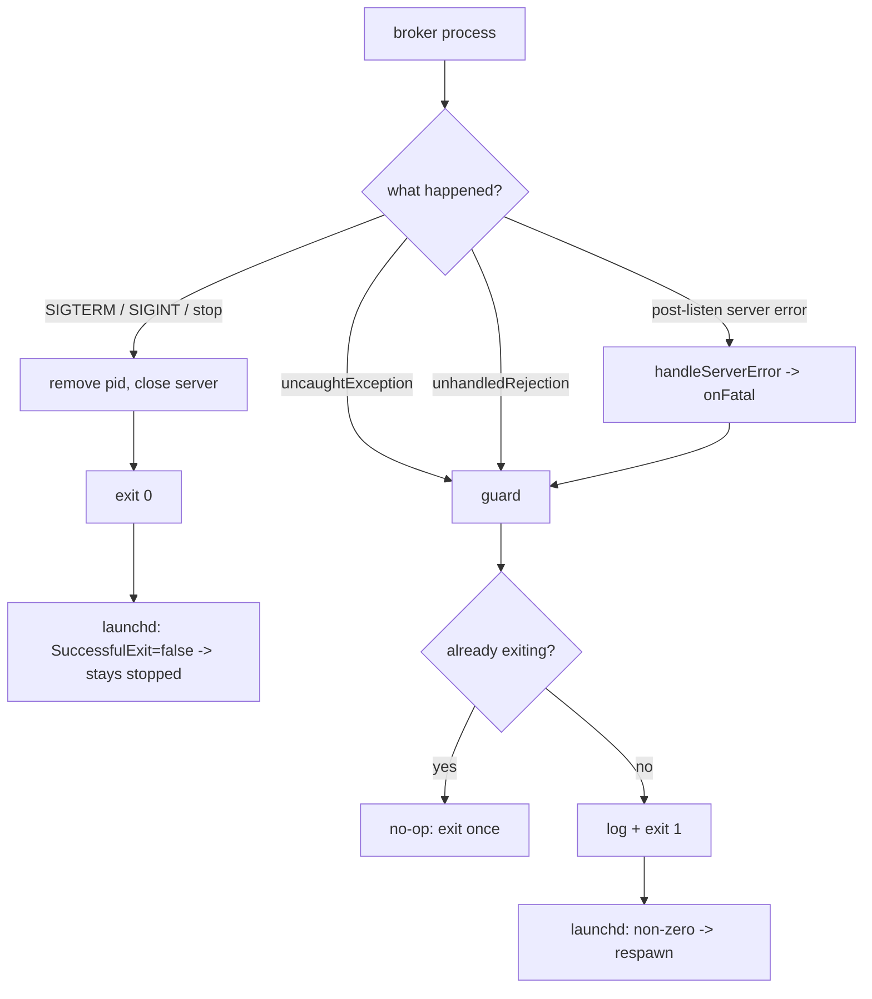

## Context

The socket broker runs as a launchd LaunchAgent whose restart policy is
`KeepAlive → SuccessfulExit=false`: launchd respawns the broker **only when it exits
non-zero**. That policy is correct only if the broker actually exits when it fails. Today
it does not. In `broker/src/server.ts`, once the listen socket is up the startup `reject`
handler is replaced with a log-only one:

```ts
server.listen(opts.socketPath, () => {
  server.removeListener('error', reject)
  server.on('error', (err) => {
    log(`server error: ${err instanceof Error ? err.message : String(err)}`)
  })
  resolve({ /* … */ })
})
```

A post-listen listener error is logged and swallowed; the process keeps running but stops
serving. `broker/src/index.ts` also has no `uncaughtException` / `unhandledRejection`
backstop. To launchd the process is still `state = running`, so it is never restarted —
the "crashes and doesn't restart" symptom, visible in the broker log as many clean
"listening" lines and zero stack traces.

This change makes the supervised broker **fail loud**: an unrecoverable runtime error
exits non-zero so the existing `KeepAlive` policy restarts it. Clean shutdown
(`SIGTERM`/`SIGINT`/`stop`) already exits zero and stays that way.

## Goals / Non-Goals

**Goals:**

- An unrecoverable runtime error (post-listen listener error, uncaught exception,
  unhandled rejection) exits the broker process non-zero.
- Exit-once: several errors in succession still produce a single exit.
- Clean shutdown paths keep exiting zero, unchanged, so a deliberate stop is not fought.
- The behavior is unit-testable without ending the test process — the exit is injected.
- No plist change: make the *existing* `KeepAlive` policy effective.

**Non-Goals:**

- **Detecting a hung broker.** launchd's exit-driven `KeepAlive` cannot see a deadlock or
  stalled event loop that never exits; that needs a health probe / watchdog and is
  deferred (see Open Questions).
- **The pinned nvm node path in the plist.** A node upgrade moves the binary and the
  agent cannot spawn at all; that belongs to the install / `doctor` work (mission
  priority 2).
- **A crash-loop circuit breaker of our own.** We rely on launchd's `ThrottleInterval`
  to pace respawns rather than adding backoff.

## Decisions

### Seam: the broker daemon process boundary (not Transport, not HandlerDeps)

This change does **not** touch the `Transport` interface in `mailbox.ts` or the
`HandlerDeps` in `handlers.ts`. It lives entirely in the broker's own process boundary:
`broker/src/server.ts` (where a listener error is observed) and `broker/src/index.ts`
(the process entry point that owns `process.exit` and the process-level backstops). One
interface changes — `StartBrokerOptions` — decided below.

### Decision: fail-loud policy lives in an injectable fatal guard, not scattered `process.exit`

A new `broker/src/fatal.ts` exports `createFatalGuard({ log, exit })` returning a
`fatal(err)` function that logs the error and calls `exit(1)` **at most once**. Production
builds the guard with `exit: process.exit`; tests build it with a fake `exit` spy, so the
exit-once and non-zero-code behavior is proven without ending the test runner.

- *Alternative — call `process.exit(1)` directly inside `server.ts`'s error handler:*
  rejected. It couples a library module to the process, cannot be unit-tested (it would
  kill vitest), and violates the repo's factory + dependency-injection norm.
- *Alternative — `throw` from the listener so it becomes an `uncaughtException` the
  backstop catches:* rejected. Indirect and fragile — an async `error` listener that
  throws relies on the exact uncaught-exception path and ordering, and reads as a bug to
  the next maintainer.

### Decision: `StartBrokerOptions` gains `onFatal` (the interface change)

```ts
export interface StartBrokerOptions {
  socketPath: string
  log?: (msg: string) => void
  onFatal?: (err: Error) => void // NEW — invoked on an unrecoverable post-listen error
}
```

The post-listen handler stops swallowing and routes through a named, testable function:

```ts
// server.ts
server.on('error', (err) => handleServerError(err, { log, onFatal }))
```

`handleServerError(err, { log, onFatal })` logs, then invokes `onFatal` when present.
`onFatal` is **optional** and defaults to log-only, so `startBroker` stays embeddable and
every existing caller and test keeps working unchanged. The **supervised** broker
(`index.ts`) is the caller that wires `onFatal` to the guard — matching the spec, which
scopes fail-loud to the supervised broker.

- *Alternative — make `BrokerServer` an `EventEmitter` and emit `'fatal'`:* rejected.
  Larger public surface, and it forces every caller to attach a listener or silently
  drop the error — the same swallow risk in a new shape.

### Decision: process-level backstops wired at the entry point

`index.ts` installs the guard on the two process events and passes it to `startBroker`:

```ts
const guard = createFatalGuard({ log: (m) => process.stderr.write(`broker: ${m}\n`), exit: process.exit })
process.on('uncaughtException', guard)
process.on('unhandledRejection', (reason) => guard(reason instanceof Error ? reason : new Error(String(reason))))
const server = await startBroker({ socketPath: paths.socketPath, log, onFatal: guard })
```

The existing `SIGINT` / `SIGTERM` shutdown (removes the pid file, closes the server,
`process.exit(0)`) is unchanged — deliberate shutdown stays a zero exit, so
`SuccessfulExit=false` leaves the broker stopped rather than respawning it.



### Decision: Testing Strategy

- **Stays pure / injectable:** `createFatalGuard` (`fatal.ts`) and `handleServerError`
  (`server.ts`) take their side effects (`exit`, `log`, `onFatal`) as parameters. No test
  ever calls the real `process.exit`.
- **New file:** `broker/src/fatal.ts` with paired `broker/src/fatal.test.ts` — proves the
  guard exits with code `1`, exits exactly once under repeated calls (idempotency /
  blind-spot), and forwards the error to `log`.
- **Extended:** `broker/src/server.test.ts` — `handleServerError` calls `onFatal` once
  with the error (happy path); a single client-connection `error` drops only that
  connection and does **not** call `onFatal` (negative scenario); starting over a live
  broker still rejects and reclaiming a stale socket still starts (edge cases, already
  partially covered — assert `onFatal` is not called on these paths).
- **Backstop wiring:** the `uncaughtException` / `unhandledRejection` registration is
  factored so it can be driven with a fake emitter, asserting each event routes to the
  guard. The real `index.ts` glue stays thin.
- **Gate:** `pnpm lint` plus both package test suites, per the repo's CI gate.

## Risks / Trade-offs

- **A deterministic startup error now crash-loops instead of sitting quietly.** →
  launchd's `ThrottleInterval` (default ~10s) paces the respawns; a throttled restart
  loop is strictly more visible and more recoverable than a silent zombie, and the log
  now carries the error on each attempt. We add no backoff of our own.
- **A hung (non-exiting) broker is still invisible to launchd.** → Out of scope and
  called out, not silently covered; tracked in Open Questions for a follow-up watchdog.
- **The `onFatal` default is log-only, so a future caller that forgets to wire it could
  reintroduce the swallow.** → Mitigated: the only supervised caller (`index.ts`) wires
  the guard, and a test asserts the wiring; the default is documented as log-only for
  embedding.
- **Re-entrancy / double exit** if several errors fire during teardown. → The guard is
  idempotent (exits once); covered by a spec scenario and a `fatal.test.ts` case.

## Migration Plan

Purely additive — no on-disk state, wire format, or plist changes. Deploy by landing the
code and restarting the agent: `make launchd-restart` (or `launchctl kickstart -k`), or
`make launchd-install` to regenerate and reload. Rollback is a plain revert of the commit;
nothing persisted changes.

## Open Questions

- **Hang detection.** Should a follow-up add a health probe (self-ping the socket, or a
  liveness file the guard/heartbeat touches) so a wedged broker is restarted too? Exit
  policy alone cannot cover it. Deferred.
- **Crash-loop escalation.** Rely on launchd `ThrottleInterval` only, or add our own
  circuit breaker after N fast failures? Proposed: rely on launchd for now.
- **Exit-code convention.** Uniform `1` for every fatal path (proposed), or distinguish
  listener error vs. uncaught exception for diagnosis?
