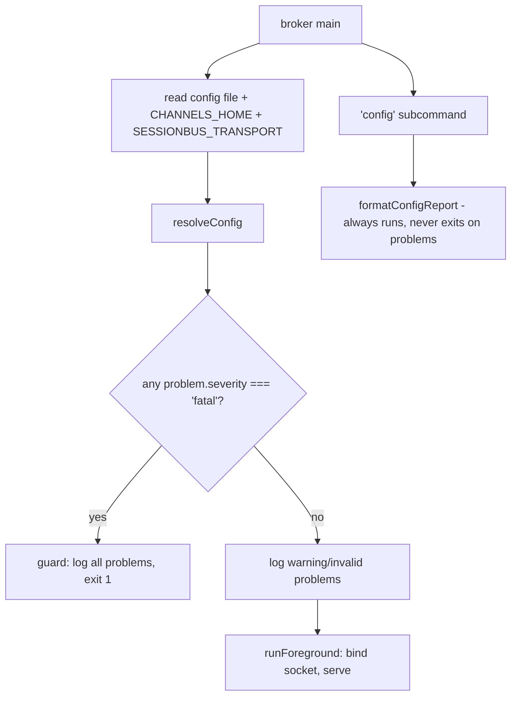

## Context

Today, configuration is `process.env` reads at module scope:

- `broker/src/index.ts`: `CHANNELS_HOME = process.env.CHANNELS_HOME ?? join(homedir(), '.claude', 'channels')`.
- `bus/src/index.ts`: the same pattern for `SESSIONS_DIR`, `CHANNELS_HOME`, `BROKER_SOCK`.
- `bus/src/transport.ts`: `mode = opts.mode ?? process.env.SESSIONBUS_TRANSPORT ?? 'file'`.
- `Makefile`'s `mcp-add` bakes `-e SESSIONBUS_TRANSPORT=$(TRANSPORT)` (default `socket`) into
  the `claude mcp add` registration; `launchd-install` bakes `CHANNELS_HOME` into the plist
  via `sed` substitution — and only `CHANNELS_HOME`, confirmed by reading
  `broker/launchd/broker.plist.template`, which already has no other `__VAR__` besides
  `__LABEL__`, `__NODE__`, `__ENTRY__`, `__CHANNELS_HOME__`, `__LOG__`, `__ROOT__`.

The upcoming Matrix bridge (out of scope here, see
`docs/superpowers/specs/2026-09-22-sessionbus-matrix-bridge-design.md` §11) needs a nested
`matrix` block, a `projects` slug-override map, and a secret — none of which fit an env var
or a plist `<dict>` cleanly. This change builds the config layer these will sit on, without
building the bridge itself.

## Goals / Non-Goals

**Goals:**

- One pure function, `resolveConfig`, that layers built-in defaults → config file →
  environment (env wins) and never throws — it returns a typed `Config` plus a list of
  `ConfigProblem`s.
- Config problems carry a `severity` (`warning` / `invalid` / `fatal`) that the caller (the
  broker entrypoint) uses to decide whether to exit, degrade, or just log.
- `bus` and `broker` consume the *same* resolved configuration, so the transport mode used by
  a session's `send_message` call and the socket path the broker binds can never disagree
  because two Makefile variables drifted.
- A `broker config` subcommand that is the fastest possible answer to "what did the broker
  actually resolve, and from where."

**Non-Goals:**

- Anything Matrix-shaped beyond the config *shape*: no `matrix-client.ts`, no homeserver
  reachability check, no room/space provisioning. The `matrix` block is validated only for
  well-formedness (right types, required sub-fields present when `enabled: true`), never for
  whether the URL is actually reachable or the token is actually valid — those checks belong
  to the bridge change and its own error table (§12 of the design doc).
- Hot-reload. `SIGHUP` config reload is out of scope, per the design doc's own explicit
  deferral — a config change requires a restart (`make launchd-restart` for the broker,
  reconnecting the MCP session for `bus`).
- Deciding the Matrix homeserver's actual URL, token, or room naming — those are deployment
  values that live in the *user's* config file, not in this repo.

## Decisions

### Seam: a new pure config module, imported across the workspace like `daemon.ts` already does

There is no existing config abstraction to extend. `config.ts` becomes a third pure/DI seam
alongside `mailbox.ts`'s `Transport` and `handlers.ts`'s `HandlerDeps`. It lives at
`broker/src/config.ts` (matching the design doc's module table, §4.1, which places all new
modules — including `config.ts` — in the `broker` package), and `bus/src/index.ts` imports it
with a relative cross-package path:

```ts
// bus/src/index.ts
import { resolveConfig } from '../../broker/src/config.ts'
```

This is not a new pattern: `broker/src/daemon.ts` already does the reverse import —
`import { isPidAlive } from '../../bus/src/registry.ts'`. The workspace is two pnpm packages
that already import each other's source directly; `config.ts` just adds a second crossing.

- *Alternative — duplicate a slimmer config reader in each package:* rejected. The whole
  point of D11 is that `bus` and `broker` must resolve identically or delivery breaks
  silently (this repo already lived through one class of "both sides must agree or messages
  vanish," documented in CLAUDE.md's beacon/subscription gotcha) — two copies is exactly the
  drift risk `config.ts` exists to remove.
- *Alternative — a third workspace package (`config/`) that both depend on:* rejected for
  this change. It is the more "correct" long-term shape but is a bigger structural move
  (new `package.json`, new `tsconfig.json`, workspace glob change) than one config module
  justifies today; the existing cross-import precedent is cheaper and consistent with how
  this repo already shares code.

### Interface: `resolveConfig({ file, env, home })`

```ts
export type ConfigSource = 'default' | 'file' | 'env'

export interface ConfigProblem {
	/** `fatal` exits the broker before it serves; `invalid` disables the Matrix bridge and
	 *  keeps running; `warning` is logged and otherwise ignored. */
	severity: 'warning' | 'invalid' | 'fatal'
	/** Dotted path of the field the problem concerns, e.g. `"channelsHome"` or `"matrix.url"`. */
	path: string
	message: string
}

export interface MatrixConfig {
	enabled: boolean
	url?: string
	tokenCommand?: string[]
	rootSpace?: string
	owner?: string
	namespacePrefix: string
	unreadCap: { messages: number; chars: number }
}

export interface Config {
	channelsHome: string
	transport: 'file' | 'socket'
	matrix: MatrixConfig
	projects: Record<string, string>
}

export interface ResolvedConfig {
	config: Config
	/** Source of each independently-settable leaf field, keyed by the same dotted path
	 *  `ConfigProblem.path` uses. */
	sources: Record<string, ConfigSource>
	problems: ConfigProblem[]
}

export interface ResolveConfigInput {
	/** Already-parsed file content, or `undefined` if the file is missing/unreadable/corrupt
	 *  (the entrypoint treats a read or parse failure as `undefined`, plus its own `warning`
	 *  problem for the corrupt case — see the file-reading decision below). */
	file: unknown
	/** Only the env vars this resolver recognizes, already read by the caller:
	 *  `CHANNELS_HOME` and `SESSIONBUS_TRANSPORT`. See "Env var surface" below for why this
	 *  set is deliberately small. */
	env: { CHANNELS_HOME?: string; SESSIONBUS_TRANSPORT?: string }
	home: string
}

export function resolveConfig(input: ResolveConfigInput): ResolvedConfig
```

`resolveConfig` never touches `process.env`, `fs`, or `child_process` — the entrypoint reads
the file and the two recognized env vars, and passes them in. This is what makes precedence
and validation testable without disk or environment mutation.

### Decision: severity model — three levels, not a boolean "valid config"

A single `valid: boolean` cannot express "the bridge is off but the broker is fine," which is
the design doc's central invalid-config requirement (§12: "Invalid `matrix` configuration:
disable the bridge and log loudly; never exit"). Three severities map 1:1 onto the three
responses the design doc already describes in §11/§12:

| Severity  | Example                                          | Caller's response                          |
| --------- | ------------------------------------------------ | ------------------------------------------- |
| `warning` | unknown top-level key; unrecognized `transport`   | log, otherwise ignore                       |
| `invalid` | malformed `matrix` block while `enabled: true`    | `matrix.enabled` forced `false`, keep running |
| `fatal`   | `channelsHome` resolves to `""` or a non-string   | exit non-zero, via the existing fatal guard |

- *Alternative — a single `errors: string[]` with no severity, let the caller pattern-match
  message text:* rejected. String-matching an error message to decide whether to exit the
  process is exactly the kind of fragile coupling the repo's own `handleServerError` /
  `createFatalGuard` split was built to avoid (see the `broker-fail-loud` design.md).

### Decision: what makes `channelsHome` "fatal" vs. `matrix` merely "invalid"

The design doc says only "such as an unusable socket path" (§11) without enumerating a rule.
Judgment call, stated explicitly because the doc doesn't: `channelsHome` is `fatal` when its
resolved value is not a non-empty string (empty string, or a non-string JSON type from the
file — a number, array, object, `null`). Everything downstream — the socket path, the pid
file, the log file — is `join(channelsHome, …)`, so an empty or wrong-typed `channelsHome` is
unusable in a way no amount of "keep running" can paper over; unlike `matrix`, there is no
"disabled" state for the broker's own socket to fall back to. `transport` holding an
unrecognized string (not `'file'` or `'socket'`) is deliberately **not** fatal and not even
`invalid` — it's a `warning` that falls back to `'file'`, preserving `transport.ts`'s existing
runtime behavior (`createTransport` already warns-and-falls-back on an unrecognized `mode`;
see `bus/src/transport.test.ts`'s "warns to stderr and falls back to file" case). `projects`
entries that aren't `string -> string` are dropped individually as `warning`s; a malformed
`projects` map never blocks the rest of the file from resolving.

### Decision: unknown keys — warn once per key, do not fail

A JSON config file's top-level keys and `matrix`'s sub-keys are checked against the known set;
anything else produces one `warning`-severity `ConfigProblem` per unknown key and is dropped
from the resolved `Config` (never round-tripped) — "so a newer config file cannot brick an
older broker" (§11, verbatim). Unknown keys are not recursed into further than one level below
`matrix`, since deeper structures (`unreadCap`) are small and fully enumerated already.

### Decision: env var surface is deliberately narrow — `CHANNELS_HOME` and `SESSIONBUS_TRANSPORT` only

The design doc's precedence sentence ("built-in defaults → config file → environment") reads
as if every field is env-overridable, but the doc names only two env vars anywhere in §11:
`SESSIONBUS_TRANSPORT` (existing, in the "no current behavior breaks" sentence) and
`SESSIONBUS_MATRIX_AS_TOKEN` (a token override, not a `Config`-field override — see the token
decision below). `CHANNELS_HOME` is not named in §11 but already exists as the env var both
entrypoints read today; keeping it recognized preserves that existing behavior. No env var
names are invented here for `matrix.url`, `matrix.rootSpace`, `matrix.owner`,
`matrix.namespacePrefix`, `matrix.unreadCap`, or `projects` — those are deployment values with
no existing env-var precedent, and inventing names for them is exactly the kind of
underspecified surface this report flags back to the design doc rather than silently filling
in. `resolveConfig`'s `env` parameter type is therefore the two-key object shown above, not
`Record<string, string | undefined>` — a third key would be a type error, not a silent no-op,
if a future author wires up `process.env` directly without extending the type.

### Decision: `broker config` — a pure formatter over `ResolvedConfig`, redaction by field name

```ts
export function formatConfigReport(resolved: ResolvedConfig): string
```

Pure (string in, string out over a `ResolvedConfig` value), so it's tested without spawning a
CLI process. It renders one line per field as `<path> = <value> (<source>)`, plus one line per
problem as `<severity>: <path>: <message>`. Redaction is structural, not content-sniffing: the
formatter never has the actual secret in hand, because `resolveConfig`'s `Config.matrix` only
ever carries `tokenCommand: string[]` (the *command*, not its output) — the token itself is
resolved by a separate step (next decision) that `formatConfigReport` never sees. This makes
"redact the token" not a rule the formatter has to remember, but a property of what data flows
into it.

### Decision: token resolution is a separate, injectable-I/O function, not part of `resolveConfig`

```ts
export interface TokenResolutionDeps {
	env: { SESSIONBUS_MATRIX_AS_TOKEN?: string }
	/** Runs `cmd[0]` with `cmd.slice(1)` as args, returns trimmed stdout or throws. Injected
	 *  so tests never spawn a real process — mirrors how `socket-transport.ts` and `daemon.ts`
	 *  already take `connect`/`spawn`-shaped functions as deps rather than importing `node:*`
	 *  directly into logic that needs to be unit-tested. */
	run: (cmd: string[]) => string
}

export type TokenResolution =
	| { ok: true; token: string }
	| { ok: false; problem: ConfigProblem }

export function resolveMatrixToken(matrix: MatrixConfig, deps: TokenResolutionDeps): TokenResolution
```

Not folded into `resolveConfig` because running `tokenCommand` is I/O (`resolveConfig` must
stay side-effect-free per the design doc's explicit "performs no I/O" contract) and because
the design doc treats it as a distinct step ("`tokenCommand` runs **at startup**" — after
config resolution, not during it). `SESSIONBUS_MATRIX_AS_TOKEN`, when set, short-circuits
`run` entirely — the command is never spawned. This function is only called when
`matrix.enabled` is `true` in the already-resolved `Config`.

**Gap this decision fills (flagged, not silently assumed):** the design doc never says what
happens when `tokenCommand` itself fails to run (binary not on `PATH`, non-zero exit, empty
stdout). Judgment call: `resolveMatrixToken` returns `{ ok: false, problem }` with
`severity: 'invalid'` and `path: 'matrix.tokenCommand'` — the same non-fatal "disable the
bridge, keep the broker running" response as a malformed `matrix` block, because a failed
secret lookup is not distinguishable in kind from "the bridge can't come up right now," and
the design doc is explicit that launchd must never restart-loop over anything Matrix-shaped
(§11's closing sentence, §12's whole premise). The error message includes the command that was
run (for diagnosis) but never the token, per the same "the token is redacted on every error
path" rule §12 states for the bridge's own error table.

### Decision: entrypoint wiring — where `resolveConfig` and the fatal guard meet



Config resolution happens **once**, at the top of `main()`, before command dispatch — every
subcommand sees the same resolved `Config`. Only the path that actually starts serving
(bare / `--foreground`, and therefore the child `start` spawns) exits on a `fatal` problem, by
calling the *existing* `createFatalGuard` from `fatal.ts` — no new exit mechanism, reusing the
one `broker-fail-loud` already built and tested. `stop` / `status` / `restart`'s stop-half /
`config` all still run even with a `fatal` problem present, because diagnosing or stopping a
misconfigured broker must not itself be blocked by the misconfiguration.

### Decision: `bus` passes a resolved `mode`, `transport.ts` itself is unchanged

`bus/src/index.ts` resolves `Config` the same way the broker does, then calls:

```ts
createTransport({ channelsHome: config.channelsHome, socketPath, mode: config.transport })
```

`createTransport`'s existing signature, its own `process.env.SESSIONBUS_TRANSPORT` fallback,
and its "unrecognized mode falls back to file with a stderr warning" behavior are all
**unchanged** — `bus/src/transport.test.ts`'s four existing cases keep passing unmodified.
Centralizing resolution in `config.ts` means `bus/index.ts` now always passes an explicit
`mode`, so `transport.ts`'s own fallback becomes dead code on the production path but stays
live (and tested) for any direct caller that constructs a transport without going through
`resolveConfig` — which is exactly what today's test suite does, and there's no reason to make
those tests worse to prove the same point twice.

- *Alternative — delete `transport.ts`'s own env fallback now that `config.ts` owns
  precedence:* rejected. It would touch a stable, already-passing test file for no behavior
  change on the path that matters (`bus/index.ts`), and it removes a safety net for any
  future direct caller (a test, a script) that doesn't go through the full config pipeline.

### Decision: `make setup` seeds `transport: "socket"` into the config file; `resolveConfig`'s own default stays `"file"`

This is the one place the design doc's example config JSON (§11, showing `"transport":
"socket"`) and the currently-passing test `bus/src/transport.test.ts`'s "defaults to file
when SESSIONBUS_TRANSPORT is unset" pull in different directions — see the Design-Doc Gaps
section of this agent's report for the exact conflict. Resolution: `resolveConfig`'s built-in
default for `transport` stays `'file'` (matches the existing, tested behavior when nothing is
configured at all — bare `node bus/src/index.ts` with zero setup stays offline-safe). Getting
to `'socket'` in the normal, `make setup`-installed case becomes the Makefile's job: `mcp-add`
drops `-e SESSIONBUS_TRANSPORT=$(TRANSPORT)`, and `setup` (or a new prerequisite target) writes
`~/.claude/sessionbus/config.json` with `{"transport": "socket"}` if the file doesn't already
have a `transport` key — merging, never overwriting a user's own file. This is a task-level
concern (shell/`Makefile`, not `vitest`-testable) and is called out as such in tasks.md rather
than given a spec requirement.

### Decision: Testing Strategy

- **`config.ts` stays fully pure.** `resolveConfig` and `formatConfigReport` take all their
  inputs as parameters; `config.test.ts` never touches disk or `process.env`. Covers: default
  precedence with nothing set; file overriding a default; env overriding both; unknown keys
  (top-level and inside `matrix`) producing `warning`s and being dropped; a non-object `file`
  value (corrupt-JSON-after-parse case, e.g. `file: []` or `file: "oops"`) falling back to
  defaults with a `warning`; `channelsHome` empty/wrong-typed producing `fatal`; `matrix`
  malformed while `enabled: true` producing `invalid` and forcing `enabled: false`; `matrix`
  fields ignored (no validation, no problems) while `enabled: false`; `transport` holding an
  unrecognized value producing `warning` and falling back to `'file'`; the blind-spot case of
  calling `resolveConfig` twice with identical arguments while mutating ambient
  `process.env` between calls, asserting the result never changes.
- **`resolveMatrixToken` tested with an injected `run`.** Happy path (command output trimmed
  becomes the token); `SESSIONBUS_MATRIX_AS_TOKEN` present skips `run` entirely (assert the
  spy is never called); `run` throwing produces an `invalid` problem, never a thrown
  exception out of `resolveMatrixToken` itself; the problem's `message` is asserted to never
  contain a literal token value used in the test fixture.
- **`formatConfigReport` tested over hand-built `ResolvedConfig` fixtures.** Each field's
  source appears in the output; a `ConfigProblem` of each severity appears in the output;
  nothing resembling a secret ever appears (the function is never given one — a fixture
  containing a `tokenCommand` array proves only the *command* prints, not a token).
- **`broker/src/index.ts` entrypoint wiring** is glue and stays untested directly (matching
  the existing convention — "glue; no unit test" for both entrypoints per CLAUDE.md's module
  table), but the two decisions it embodies are each proven at the unit level: "`fatal`
  problems reach the existing guard" is proven by feeding `resolveConfig`'s `ResolvedConfig`
  into a small, named, testable function (not inlined in `main`) that decides
  guard-vs-continue, e.g. `hasFatalProblem(problems: ConfigProblem[]): boolean` — mirroring
  `handleServerError`'s pattern of factoring the decision out of the closure so it's callable
  from a test.
- **`bus/src/transport.test.ts` is extended, not replaced:** one new case constructs a
  `ResolvedConfig` with `transport: 'socket'` sourced from a fake file with no env override,
  passes `resolved.config.transport` as `createTransport`'s `mode`, and asserts socket-mode
  behavior (file mailbox not read) — proving the config-to-transport handoff without touching
  `bus/index.ts`'s untested glue.
- **Gate:** `pnpm lint` (biome + `tsc --noEmit` per package) plus both package test suites,
  per the repo's CI gate — unchanged from `broker-fail-loud`'s precedent.

## Risks / Trade-offs

- **A `fatal` `channelsHome` problem now stops the broker from starting at all, where today a
  bad `CHANNELS_HOME` env var just gets `join()`'d into a path that probably still works (or
  fails less legibly, deep inside `mkdirSync`).** → This is the intended improvement — a
  clear, redacted, single-line reason beats a `mkdirSync` stack trace three modules away. The
  new failure mode is exercised by a `broker config` run before it ever needs to be exercised
  by a crash.
- **Two packages resolving one config file doubles the places `~/.claude/sessionbus/config.json`
  is read.** → Both reads go through the same `resolveConfig`, so a parse bug is a single bug,
  not two that can drift — the same reasoning that already justifies the cross-import for
  `isPidAlive`.
- **`make setup` now has a responsibility (seed `transport: "socket"`) it didn't have before,
  and it's shell, not a unit-tested module.** → Scoped to one idempotent, mergeable write;
  tasks.md includes a manual verification step (`make setup` twice is a no-op the second
  time) since this piece isn't `vitest`-reachable.
- **`resolveMatrixToken`'s `run` dependency is unused by every consumer until the bridge
  change lands.** → Acceptable: the design doc is explicit that this change is "a
  prerequisite for change 1 in §15, not a change of its own" — the function exists now so the
  bridge change doesn't retrofit it later, exactly as the design doc argues for building
  configuration ahead of the knobs that will use it.

## Migration Plan

Purely additive on the code side — no on-disk state format changes (the config *file* is new,
but its absence is a fully supported, already-defaulted state). Deploy order:

1. Land `broker/src/config.ts` + tests. No behavior change yet — nothing calls it.
2. Land the `broker/src/index.ts` wiring (resolve-once, fatal routing, `config` subcommand).
   Behavior change: a `fatal`-severity `channelsHome` problem now exits before serving, where
   today it would have limped into `mkdirSync`/`net.Server.listen` and failed less clearly.
   No behavior change for the common case (no config file, no relevant env problems).
3. Land the `bus/src/index.ts` wiring. Behavior change: transport mode now comes from the
   shared config instead of `bus/index.ts`'s own env read — functionally identical as long as
   `SESSIONBUS_TRANSPORT` is still set the same way it is today, so this step alone is
   backward-compatible.
4. Land the `Makefile` change (drop `-e SESSIONBUS_TRANSPORT=$(TRANSPORT)`, seed the config
   file's `transport` key). This is the step that actually changes production behavior for an
   installed broker — do it last, after 1–3 are proven, and verify with `make setup` followed
   by `bus`'s MCP registration showing no `-e` flag and a session still reaching the broker
   over the socket.

Rollback at any point is a plain revert; nothing persisted by this change is read by anything
that predates it (`~/.claude/sessionbus/config.json` is new and additive; its absence is the
pre-change state).

## Open Questions

- **Per-leaf-field source granularity.** This design tracks source per independently-settable
  leaf (`channelsHome`, `transport`, each `matrix.*` field, `projects` as a whole map) rather
  than per top-level key. The design doc's "(default, file, env)" language (§11) doesn't say
  which granularity it means. Flagged in this agent's report; proposed resolution is
  leaf-level, since a whole-file granularity would report `matrix` as `"file"` even when only
  `matrix.enabled` was actually set there and the rest are library defaults, which is a less
  useful answer to "why is the bridge off."
- **Whether `projects` needs any env-var expression at all**, given it's a path map with no
  natural single-value env encoding. This design says no (file-only). If a future change wants
  a project override expressible via a one-off env var (e.g. for a CI job), that's new surface
  the design doc doesn't currently ask for.
- **Whether `resolveMatrixToken`'s `invalid`-on-failure choice should instead be `fatal`** for
  the specific case of a `tokenCommand` that references a nonexistent binary (an operator typo
  in their own config, arguably closer to "unusable core configuration" than "homeserver is
  having a bad day"). This design keeps it `invalid` for consistency with every other
  Matrix-shaped failure per §12's blanket rule, but the doc doesn't rule on this specific
  sub-case, so it is called out rather than asserted as obviously correct.
