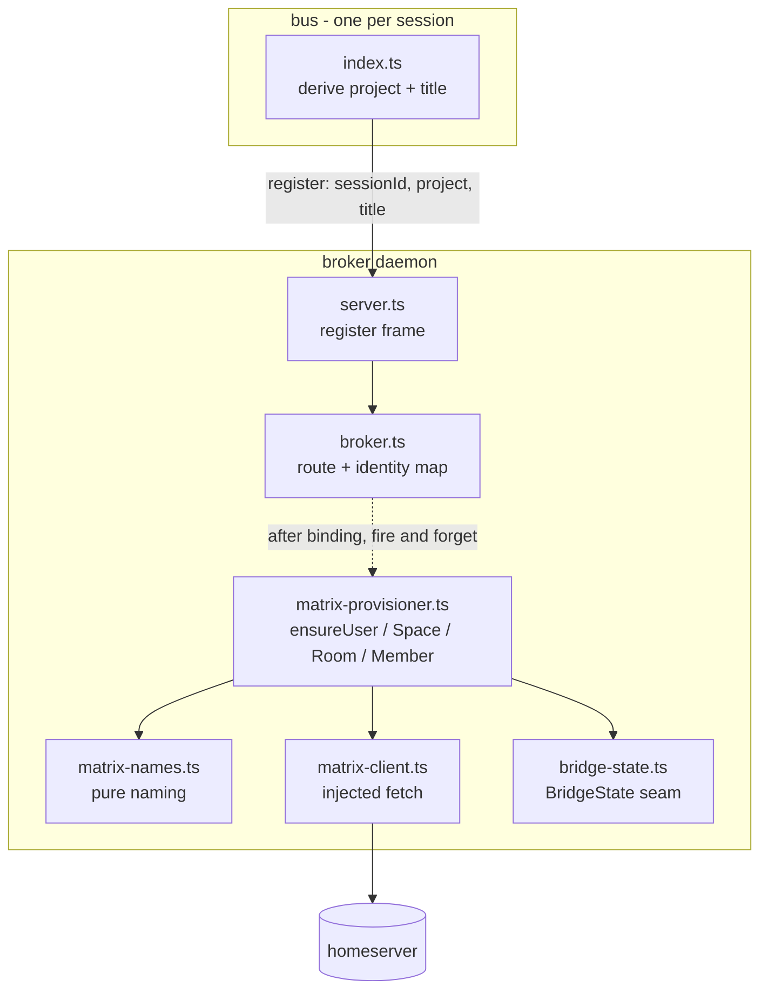
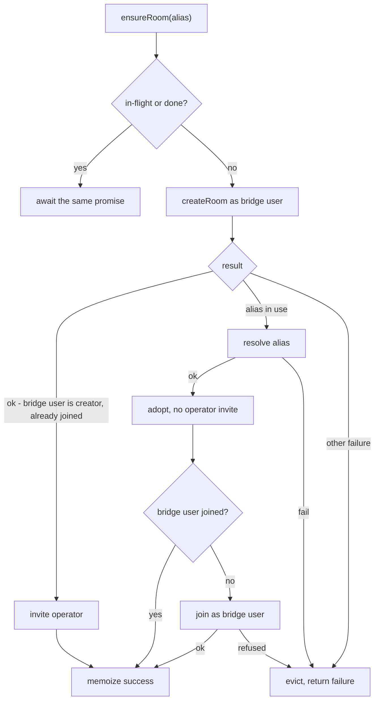

## Context

The broker is the one long-lived, supervised process and it already owns routing, so it is
where a homeserver client belongs: one process holds one credential, and a future inbound
mention can converge on the same `route()` call a local send already uses. Nothing of that is
reachable until a session reliably *has* a remote user and a room to talk in, which is what
this change builds.

Four new modules land in `broker/`, plus two optional fields on the register frame and the
project derivation that fills them in `bus/`. Nothing here sits on the local delivery path.



The dashed edge is the whole safety story: binding happens first, provisioning is started
afterwards and is never awaited.

## Goals / Non-Goals

**Goals:**

- A pure naming function that two independent callers can rely on to agree, forever.
- Identifiers that cannot collide across projects or identities, and that stay inside the
  255-byte Matrix-ID limit without losing what distinguishes them.
- A client whose every failure is a typed value, never a throw and never a token leak.
- Provisioning that is idempotent, race-safe within the process, and race-safe against another
  process through alias adoption.
- A `BridgeState` seam with durable, atomic, tolerant persistence — ready for the cursors and
  thread handles that later changes write through it.
- Registration that announces project and title without ever delaying local delivery.

**Non-Goals:**

- **The configuration layer.** A resolved configuration object is an input here. Producing it
  (defaults → file → environment, a pure resolver, a `config` subcommand) is a sibling change
  and a hard prerequisite. The one exception is `matrix.domain`, added to that layer here: the
  identifier budget is computed against the fully qualified id, so naming cannot be written
  without a server name, and the alternative — inferring it from `matrix.url` or from
  `matrix.owner` — is wrong in ordinary deployments and silent when it is.
- **The outbound mirror**, the inbound relay, `read_history`, and threading. `bridge-state.ts`
  carries the *shape* those need; nothing here writes cursors or thread handles in anger.
- **Generalizing the identity convention.** This design consumes `parseSessionName` as it
  stands and adds a project dimension beside it. When the convention becomes pluggable, the
  naming module takes the strategy's output instead of `role`/`epic`/`issue` directly.
- **Retry policy and backoff for per-session provisioning.** A failed session ensure is reported
  and evicted, and the next registration retries it; scheduling retries of individual rooms is
  the bridge's job in a later change. The **one exception** is the bridge's own user, which is
  retried with backoff here because every other ensure is gated on it — see the bootstrap
  decision below.

## Decisions

### Seam: two new seams, and one existing wire contract extended

This change goes through **neither** `Transport` (`bus/src/mailbox.ts`) nor `HandlerDeps`
(`bus/src/handlers.ts`). It needs its own seams:

1. **`BridgeState`** — an interface with one file-backed implementation, the same shape of seam
   as `Transport`. Named now so a later move to another store is a decision rather than a
   drift; the trigger is stated under Risks.
2. **The injected `fetch` in `matrix-client.ts`** — the single place that talks to the network,
   so every layer above is testable without a homeserver.

And one existing interface changes: `RegisterFrame` in `broker/src/protocol.ts`.

### Decision: `RegisterFrame` gains two optional fields; the protocol version does not move

```ts
export interface RegisterFrame {
  type: 'register'
  sessionId: string
  protocolVersion: number
  project?: string // NEW — derived from the session's cwd
  title?: string // NEW — the session's current registry title
}
```

Both are optional, so an old `bus` registering against a new broker binds exactly as today and
the version stays at `1`. `server.ts` already rejects a client whose `protocolVersion` differs;
bumping it would make an un-upgraded `bus` **unreachable** rather than merely unprovisioned —
a strictly worse failure than no rooms.

- *Alternative — a separate `announce` frame after `register`:* rejected. It adds a frame and a
  second ordering to reason about, for two fields that are known at register time and are
  useless without it.
- *Alternative — bump `PROTOCOL_VERSION` to 2:* rejected, per above. The change is additive and
  both directions interoperate.

`title` is sent even though the broker could not derive it itself: the broker has no access to
the session registry (`bus` owns that read), and re-deriving it would duplicate the parsing
that `session-discovery` already specifies.

### Decision: provisioning is started after binding and never awaited

```ts
// server.ts, inside the register branch
conn.send({ type: 'welcome', protocolVersion: PROTOCOL_VERSION })
core.register(conn, frame.sessionId, { project: frame.project, title: frame.title })
```

`core.register` binds synchronously as it does today and then, only when a project is present,
invokes an injected `onRegistered` hook. The hook is fire-and-forget with its own `catch` — a
single un-`catch`ed promise would reach `wireFatalHandlers`, become an `unhandledRejection`, and
exit the broker through the back door. A homeserver outage would then look exactly like a
broker crash, which `broker-lifecycle` exists to keep distinct.

The provisioner therefore never rejects to its caller either: `ensure*` returns a result value,
and the hook's `catch` is a backstop against a programming error, not the error path.

- *Alternative — await provisioning before sending `welcome`:* rejected outright. It turns a
  remote timeout into local message loss.

### Decision: naming is one pure module over dot-separated segments

`matrix-names.ts` exports a `createNamer(opts)` factory (prefix, homeserver domain) returning
pure functions. The slug rule is lowercase → strip one trailing `.git` → collapse `[^a-z0-9]+`
to `-` → trim edges. A slug may come back empty and `slug()` invents nothing to cover it; what
an empty slug means is the caller's decision, settled below.

Identifiers are then assembled as **dot-separated segments**:

| Thing | Pattern | Example |
|-------|---------|---------|
| Project space | `#<prefix>.<repo>` | `#cc.sessionbus` |
| Project lobby | `#<prefix>.<repo>.lobby` | `#cc.sessionbus.lobby` |
| Epic room | `#<prefix>.<repo>.epic.<n>` | `#cc.sessionbus.epic.42` |
| PM user | `@<prefix>.<repo>.pm.<n>` | `@cc.sessionbus.pm.42` |
| Worker user | `@<prefix>.<repo>.w.<issue>` | `@cc.sessionbus.w.issue-123` |
| Unstructured session | `@<prefix>.<repo>.s.<title>` | `@cc.sessionbus.s.planning-notes` |
| Bridge bot | `@<prefix>.bridge` | `@cc.bridge` |

`.` is the load-bearing choice. Slugging collapses everything outside `a-z0-9` to `-`, so `.`
**cannot occur inside a segment** — an identifier therefore splits back into its segments
unambiguously, and free text is used verbatim in its own segment however many `-` it contains.
With `-` doing double duty as both the intra-slug character and the structural separator, that
is false, and by a mundane counterexample:

| Project | Identity | Identifier under a single `-` |
|---------|----------|-------------------------------|
| `x` | worker on issue `w-1` | `@cc-x-w-w-1` |
| `x-w` | worker on issue `1` | `@cc-x-w-w-1` |

The same shape collides a project named `foo-lobby` with `foo`'s lobby, and a project named
`x-epic-42` with `x`'s epic room. Under `.` all three are distinct by construction:
`@cc.x.w.w-1` vs `@cc.x-w.w.1`, `#cc.foo.lobby` vs `#cc.foo-lobby`, `#cc.x.epic.42` vs
`#cc.x-epic-42`. Both `.` and `-` are valid in a user localpart and in a room-alias localpart,
so nothing is given up for it.

- *Alternative — keep `-` as the separator and escape it as `--` inside the project segment:*
  rejected. It delivers the same guarantee but costs an escape rule that every writer and every
  reader has to apply and keep applying — including a human reading an identifier in a client,
  who now has to know that `x--w` means the project `x-w`. It also complicates the truncation
  arithmetic, since shortening an escaped segment can split a `--` pair. A separator that
  simply cannot occur is a property; an escape is a discipline.
- *Alternative — reserve the suffixes (`-lobby`, `-epic-<n>`) and hash any project slug that
  ends in one:* rejected. It patches the two collisions that were noticed and leaves the
  worker/project one open; a rule that is not general is worse than no rule.

### Decision: length is budgeted against the fully qualified id, and the hash covers the whole localpart

The 255-byte limit applies to `@localpart:domain`, not to the localpart alone, so the budget
depends on the homeserver domain and must be computed, not assumed. When the untruncated
localpart overflows:

1. Compute `hash = sha256(untruncatedLocalpart).hex.slice(0, 8)`.
2. Reserve room for `.<hash>` and for the kind marker plus discriminator.
3. Shorten the **project segment** to whatever remains, trimming any trailing `-`.
4. If the discriminator alone still overflows, shorten it from its end; the kind marker always
   survives.

Hashing the **untruncated localpart** is the load-bearing part. Hashing only the project name
would let two workers whose long issue tokens differ in the last character truncate onto one
user; hashing after truncation would be constant across exactly the inputs that need telling
apart. Eight hex characters is 32 bits — ample for a handful of projects on one machine, and
short enough to keep the readable part readable.

The separator earns its keep a second time here: because the hash is appended as its own
segment, a truncated identifier has one more segment than any untruncated identifier of the
same kind, so the two forms cannot collide either. Shortening a segment can also never create
a spurious boundary, because a `-` inside a segment is not a boundary.

### Decision: the client returns a discriminated union and never throws

```ts
export interface MatrixOk<T> {
  ok: true
  value: T
}
export interface MatrixErr {
  ok: false
  kind: 'auth' | 'rate_limited' | 'server' | 'network' | 'matrix'
  status?: number
  errcode?: string
  retryAfterMs?: number
  message: string
}
export type MatrixResult<T> = MatrixOk<T> | MatrixErr
```

`interface` for the object shapes, `type` for the union, per the repo's rule. Mapping: 401/403
→ `auth` (not transient; a caller disables rather than spins), 429 → `rate_limited` with the
server's delay, 5xx → `server`, a rejected `fetch` or an unparseable body → `network`, any
other 4xx carrying a Matrix error body → `matrix` with its `errcode`. The provisioner branches
on `errcode` for `M_USER_IN_USE` and for an alias already in use; every other decision it makes
is on `kind`.

`message` is built from the status and `errcode` only — never from the request, never from a
header. That is what makes "the token appears in no returned value" a property of construction
rather than of discipline, and the token is only ever read from the closure when a request is
built.

Acting as a user is a query-parameter masquerade available to an appservice credential
(`?user_id=<full user id>`); the client takes an `asUser` on each call and the tests assert it
on the outgoing request. Creation calls carry **no** transaction id: room creation has none in
the client-server API, so sending one would be a parameter the homeserver ignores — and a
reader would take creation for retry-safe on the strength of it. What actually makes a repeated
create safe is adopting the alias it collides with, which is specified in its own right below.
Transaction ids belong where the protocol has them, on message sends, which this change does
not touch.

**The bridge's own user is masqueraded like any other.** The credential has a sender identity of
its own, and it is deliberately *not* the bridge's user: the homeserver refuses a sync stream for
an appservice's sender identity, and the relay's whole design is one sync stream held as the
bridge's user. So the registration's sender localpart is a separate, idle account that nothing
ever acts as, and `@<prefix>.bridge` is an ordinary user inside the namespace. Every call meant
to act as the bridge — creating a room or space, joining, inviting, listing its joined rooms —
therefore carries `?user_id` naming it, exactly as a session call does.

This makes `asUser` effectively mandatory, so it is a required parameter rather than an optional
one. A call that omitted it would silently act as the idle sender identity, which is a member of
nothing: the room would exist with the wrong creator, and the bridge would not be in it. Making
the parameter required turns that into a type error instead of a room nobody can hear. The one
exception is registration, which cannot masquerade as an account it is about to create.

### Decision: the provisioner memoizes in-flight promises, keyed per object, and evicts failures

`createProvisioner(deps)` owns a `Map<string, Promise<Result>>` in its closure — factory
returning a closure, per the repo rule, so each test constructs its own and nothing leaks
between cases. A second caller for the same key awaits the first promise, so two sessions
registering at once issue one create.

On a **failed** result the entry is deleted, so the next caller retries. A cached failure would
leave a session without its room for the life of the daemon — indistinguishable, from the
operator's seat, from the bridge being off.

Adoption is the race that memoization cannot cover, because the other racer is another process
or a previous run: a create that fails with an alias-in-use error is followed by an alias
resolve, and the resolved room is adopted. Adoption deliberately skips the operator invite —
re-inviting on every restart would drag an operator who left a room back into it.



`ensureSpace` adds the link to the root space and records, **per parent**, that a failed link is
not to be retried — so a homeserver where the bridge lacks power level does not issue one doomed
request per registration. Per parent rather than per pair: the power to nest belongs to the
parent space and does not vary by child, so recording the pair would suppress only a repeat of
the identical link and leave every *other* space to fail against the same root.

### Decision: rooms are created as the bridge's own user, and its membership is ensured on adoption

The inbound relay observes every room through **one** `/sync` stream, held as the bridge's own
user (`@<prefix>.bridge`). The appservice is registered with no inbound URL, so the homeserver
pushes nothing, and `/sync` returns events only from rooms the syncing user has joined. A room
the bridge's user is not in is therefore invisible to the relay — and nothing anywhere reports
it: provisioning succeeded, mirroring posts succeed, the operator reads the room normally. A
mention there simply never wakes anyone. That is the failure shape this repo's identity gotcha
documents — a layer reporting success while it cannot receive — so it is specified as a hard
precondition of a successful ensure, not a best effort.

Two cases, handled differently:

- **Created rooms and spaces are created *as* the bridge's user.** The creator is joined by
  construction, so membership costs no extra request and cannot fail independently of
  creation. It also makes the bridge's user the room's highest-power member, which is what lets
  it invite the operator and invite session users into an **invite-only** room — a masqueraded
  session user cannot join one uninvited, so a room created as a session user would need the
  bridge's user invited *and* joined as two extra steps anyway.
- **Adopted rooms get their membership ensured.** A room adopted by alias may predate the bridge
  or have been made by hand. The provisioner checks whether the bridge's user is already joined
  (from its own record of rooms it created or joined in this run, and otherwise from one listing
  of the bridge user's joined rooms, fetched once per run) and joins only when it is not. A
  refused join fails the ensure, which is evicted like any other failure, so the next
  registration retries.

This sits beside "an adopted room is trusted as-is" rather than against it. That decision is
about the room's **settings** — join rule, history visibility, topic — which belong to whoever
owns the room. The bridge's own **participation** is not a setting of the room; it is a
precondition of the system working at all. The provisioner changes nothing about an adopted room
except adding its own user to it.

One consequence worth stating: if an adopted room's history visibility is *not* `shared`, the
bridge's user sees that room only from the moment it joins. Trusting settings as-is means
accepting that, and it is the operator's call to widen it.

- *Alternative — sync as each session user instead of one bridge user:* rejected. It is N
  long-polls instead of one, each holding a connection open against the homeserver, each with
  its own sync position to persist, and each needing the same event deduplicated across every
  stream that saw it — a mention in an epic room would arrive once per member session. One
  syncing user makes the stream, the position and the dedupe each singular, which is what the
  relay's own "one stream serves every room" requirement already assumes.
- *Alternative — create rooms as the first session user, then invite and join the bridge's
  user:* rejected. Two extra requests per room, a window in which the room exists without the
  bridge in it, and a room whose top power level belongs to a session identity that may never
  register again.
- *Alternative — on a refused adoption join, invite the bridge's user on behalf of some other
  namespace member already in the room, then retry:* deferred. It would recover hand-made rooms
  automatically, but it needs a member with invite power to exist and be found, and it turns a
  clear failure into a heuristic. Today a refused join fails the ensure and the remedy is the
  operator inviting the bridge's user once.

### Decision: the bridge's own user is bootstrapped once, and gates all provisioning

**A successful `whoami` does not prove the account exists.** `whoami` answers with the
credential's own sender identity whether or not that account has ever been created, and being
permitted to act as a name in the namespace is not the same as that name existing. Until a user
is registered it has no profile, cannot be found to invite, and cannot create anything. That
misreading is precisely what hid this gap: the credential check passed, so the account was
assumed. Nothing in this design, and no diagnostic built on it, may treat `whoami` as an
existence check — and note that `whoami` does not even answer *about* the bridge's user, since
that user is not the sender identity. Registration's own "already in use" answer is the check.

Since every room and space is created as the bridge's user, it is a hard precondition, so it is
handled as a **bootstrap gate** rather than as one more memoized ensure:

- The bridge starts one ensure of its own user when it starts. The provisioner holds a single
  readiness promise; `provisionSession` awaits it before issuing anything. A session that
  registers early therefore waits — it is not provisioned out of order and not dropped — and
  because provisioning is already fire-and-forget off the register path, waiting costs local
  delivery nothing.
- `M_USER_IN_USE` is success, exactly as for session users.
- A transient failure (server error, transport failure, rate limit) is retried with exponential
  backoff and full jitter — base one second, doubling, capped at sixty seconds, matching the
  startup row of the error-handling table — and a `429` waits at least the server's
  `retry_after_ms`. The gate is never memoized as failed; it stays pending while retries run.
- An authentication refusal is not transient. Retrying a revoked token only spins, so the gate
  resolves as **disabled**: waiting provisioning returns a failure without sending a request, and
  nothing further is attempted until the broker is restarted with a working credential.
- Nothing on this path may end the process. Every retry runs inside its own `catch`, for the same
  reason as the register hook: an escaped rejection would reach the fatal handlers and turn a
  homeserver outage into a broker crash-loop.

The clock and the jitter source are injected, so backoff is tested without sleeping.

**Display name: the bridge sets none.** The bridge's user is a long-lived account the operator
set up and named; its display name is theirs to choose, and this system neither sets it on
registration nor reads it to check. That is the same rule as an adopted room's settings, for the
same reason — a daemon that silently overwrites a human's deliberate choice is worse than a name
that looks inconsistent — and here it is stronger, because the bridge's user is *one* account
rather than one per identity, so there is nothing to keep in sync and no drift to chase.

This does not touch session users. Their display name **is** derived state: it tracks the
session title, which the system already owns, so the title-derived rule and its in-process memo
stand exactly as specified.

- *Alternative — register the bridge's user lazily, on the first room create that fails for lack
  of it:* rejected. It makes the failure path the normal path on every fresh homeserver, and
  turns a clear startup precondition into error-driven control flow scattered across every
  ensure.
- *Alternative — treat bootstrap failure as fatal and let the supervisor restart the broker:*
  rejected. A homeserver outage is not a broken broker; the restart would sever every local
  session's connection to fix nothing, and a revoked token would crash-loop forever.
- *Alternative — make it a deployment step only, done by hand on the homeserver side:* rejected.
  It worked once, live, which is how the gap was found; relying on it means every new
  homeserver, and every wipe of this one, silently fails provisioning until someone remembers.

### Decision: users are registered with `inhibit_login`, never logged in

Both the bridge's user and every session user are registered the same way:

```json
{ "type": "m.login.application_service", "username": "<localpart>", "inhibit_login": true }
```

sent to the client registration endpoint with the appservice token as the bearer credential.

`inhibit_login: true` is the point. Without it, each registration also logs the new user in,
minting a device and an access token. This system never needs either: every action goes through
the appservice token, masquerading as the user it acts for. A login would therefore create a
device that is never used and never cleaned up — one per identity, and one more on every
re-registration attempt that races — accumulating in each user's device list for nothing, and
an access token that is one more secret in existence with no holder. Registering without
logging in creates exactly the account and nothing else.

- *Alternative — log in and discard the returned token:* rejected. Discarding the token does not
  remove the device or revoke the token; it only makes them invisible to us.

### Decision: `BridgeState` is an interface with an explicit `flush`

```ts
export interface BridgeState {
  getSyncToken(): string | undefined
  setSyncToken(token: string): void
  getCursor(identity: string): string | undefined
  setCursor(identity: string, eventId: string): void
  resolveThread(handle: string): string | undefined
  rememberThread(handle: string, rootEventId: string): void
  flush(): void
}
```

Reads are served from memory, so a value is visible the instant it is set; writes are debounced
and persisted as one JSON document written to a temporary name and `renameSync`d into place, so
a reader never observes a partial document. A malformed or unreadable document is treated as
absent and is replaced by the next flush — the same tolerance `readSessionEntries` already
applies, for the same reason.

`flush()` is the addition worth arguing for. Debouncing alone means a deliberate shutdown
between two writes loses everything set since the last debounce fired, and a deliberate
shutdown is the *common* case for this daemon. The broker's existing `SIGTERM`/`SIGINT` path
calls `flush()` before exiting; the fatal path does not, because a fatal exit must stay fast and
the state is reconstructible.

- *Alternative — write synchronously on every set:* rejected. Cursors move several times a
  minute in a later change, and each write is a whole-document rewrite.
- *Alternative — `node:sqlite`:* rejected for now and the trigger named so it stays a decision:
  persisting the mirror queue, wanting offline history search, or passing roughly ten thousand
  rows. A few hundred single-writer key-value rows do not need a query engine, a schema, or
  migrations.

### Decision: project derivation splits pure parsing from the one unavoidable read

`matrix-names.ts` exports `projectFromRemote(url)` — pure, handling `git@host:owner/repo.git`,
`ssh://git@host:22/owner/repo.git` and `https://host/owner/repo/`, returning the final path
segment with one trailing `.git` and any trailing `/` removed. `bus/src/index.ts` does the only
I/O: read the `origin` remote for the session's working directory, fall back to the directory's
own name, slug it, and omit the field when the result is empty.

The project is the **repository name**, not `owner/repo`. Both the naming examples and the
configuration override that exists for this are bare repository names, and an alias a human has
to type should stay short. The cost is that two repositories with the same name in different
organizations share a project; the configuration override is the documented escape hatch, and
it is why that override exists.

### Decision: an empty project slug means no project, not a generated one

A directory whose name slugs to nothing (all punctuation, or a filesystem root) produces no
project, the register frame omits the field, and the session is not provisioned. `slug()` never
invents a substitute.

The tempting alternative is to fall back to a hash of the original name, which is what the
earlier draft of this design did, and it is wrong for two reasons. First, the artifact is
user-facing: a hash-named project mints `#cc.3f9a1c22` and `#cc.3f9a1c22.lobby`, which a human
scrolling a client cannot match to anything, and which nothing later can rename. Second, it
buys nothing — a session with no project is **already** a supported state, specified and
tested, so the fallback adds an unrecognizable second state rather than rescuing the session
from an unhandled one.

The same reasoning does **not** apply to a discriminator. An empty issue token or title yields
the literal `unnamed`, because there the session does have a project and must land somewhere
inside it; `unnamed` is readable, and two sessions that share it genuinely share a work
identity under the title-derived rule.

- *Alternative — a shared catch-all project for every undeducible session:* rejected. It mixes
  unrelated work from unrelated directories into one room, which is worse than no room.

### Decision: an adopted room is trusted as-is

A room adopted by alias is used exactly as found: no operator invite, and no reconciliation of
its join rule, history visibility or topic against what creation would have asked for.

Two reasons, and the second is the stronger. The system may simply lack the power level to
change a setting in a room it did not create, so reconciliation would be an error path that
fires on every registration and can never succeed. And where it *would* succeed, it would be
undoing a change the operator made deliberately — an operator who widened a room's history or
retitled it did so on purpose, and a daemon that silently reverts that on restart is worse than
a drifted topic. Drift here is visible and repairable by hand; a fighting daemon is neither.

- *Alternative — reconcile on adoption and log what changed:* rejected. It makes the common
  case (adopting our own room from a previous run) issue redundant state events, and the
  uncommon case a fight.

### Decision: the fatal path does not flush bridge state

`flush()` runs on the deliberate-shutdown path only. The fatal path stays as it is: log and
exit non-zero, as fast as possible.

Everything in this store is reconstructible. A lost sync token restarts the stream at "now", a
lost cursor costs one duplicated catch-up window, and a lost thread handle is re-minted. None
of that is worth delaying an exit whose entire purpose is to let the supervisor restart a
broken process promptly — and a flush on the fatal path would be a disk write inside an error
handler that may itself be firing because the process is in a bad state.

- *Alternative — flush on every path:* rejected, per above.
- *Alternative — flush on a timer only, with no explicit flush at all:* rejected under the
  `BridgeState` decision above; a deliberate shutdown between debounce windows would lose every
  value set since the last one, and deliberate shutdown is this daemon's common exit.

### Decision: the identity map is rebuilt on registration, never appended to

`broker.ts` gains `identityOf: Map<sessionId, identity>` and `sessionOfIdentity: Map<identity,
sessionId>`, both updated inside the existing `register`, beside the logic that already drops a
conn's previous session binding. A session registers more than once — a resumed launch corrects
its id moments after start — so the previous identity entry is removed before the new one is
written, and `disconnect` removes the entry it owns. This is the broker-side twin of the
beacon/subscription rule: two structures that name a session must move together, or one of them
addresses a session nobody answers to.

Nothing in this change reads the map. It is built here because this is where registration is
already being touched, and because the rekey bug it prevents is a registration bug.

### Decision: Testing Strategy

No test touches a live homeserver, and no test performs network I/O.

**Stays pure:** `matrix-names.ts` entirely — slugging, segment assembly, the length budget, the
hash segment and `projectFromRemote`. It is the cheapest place to be thorough, so the collision and
truncation guarantees are proven there by construction rather than inferred from a request log.

**Faked:**

- `fetch`, injected into `matrix-client.ts`. Tests hand it a function returning a scripted
  `Response`-shaped object (or rejecting), and assert on the captured request: the masquerade
  parameter, the absence of a transaction id, and status-to-outcome mapping. Token-leak tests build the
  client with a distinctive token and assert it appears in no serialized outcome and no
  collected log line.
- The client, injected into `matrix-provisioner.ts` as a narrow interface — the provisioner
  never sees `fetch`. Its fake counts calls per endpoint, which is how "exactly one create" and
  "the link is not retried" become assertions rather than log inspection.
- The provisioner, injected into the broker's register path as an `onRegistered` hook. The
  "never awaited" requirement is tested with a hook returning a promise that never settles and
  one that rejects.
- The clock for the state debounce and for the bridge-user bootstrap backoff, and the jitter
  source for that backoff, all injected, so no test sleeps and backoff sequences are exact. The
  bootstrap tests assert on the fake client's **ordered** request log, which is how "no session
  user is registered ahead of the bridge's user" becomes an assertion rather than a timing
  hope.

**New paired test files:** `broker/src/matrix-names.test.ts`, `matrix-client.test.ts`,
`matrix-provisioner.test.ts`, `bridge-state.test.ts`.

**Extended:** `broker/src/protocol.test.ts` (a register frame with and without the new fields
round-trips; a frame carrying unknown extra keys still decodes), `broker/src/broker.test.ts`
(the identity map is rebuilt on re-registration and cleared on disconnect; the hook fires only
when a project is present), `broker/src/server.test.ts` (binding and acknowledgement precede
provisioning; a rejecting hook does not signal a fatal exit), and `bus`'s coverage for project
derivation and the fields the register frame now carries.

`bridge-state.test.ts` writes under a per-test temporary directory, and covers the blind spots
the repo asks for: a value readable before it is durable, a flushed value surviving a new
instance, no temporary artifact left beside the document, a malformed document reading as
absent and being replaced, and last-write-wins for a key set twice before a flush.

**Gate:** `pnpm lint` (biome plus `tsc --noEmit` per package) and both package suites.

## Risks / Trade-offs

- **An identifier is forever.** Anything named here attributes history, so changing the naming
  rule later orphans everything already posted. → The rule is pure, fully specified, and its
  guarantees are pinned by tests; the `.` separator is chosen precisely so a future fix is not
  needed. A rename would have to come with a migration, which is why the collision case is
  closed now rather than when it is first observed.
- **Two repositories with the same name share a project.** → Accepted and documented; the
  configuration override exists for it. Using `owner-repo` instead would make every alias longer
  for a case that is rare on one machine. Revisit if it bites.
- **A worker identity is keyed on the issue token, not on the issue *and* the epic.** Two epics
  that each have a worker for issue `123` share one user and therefore one history
  attribution. → Accepted: the same issue worked under two epics is arguably the same work
  identity, and the epic still separates the rooms. Named here so it is a decision, not a
  surprise.
- **A session renamed to a different role gets a different user.** History stays attributed to
  the old identity rather than following the session. → Intended. Attribution that follows a
  mutable title would rewrite history on every rename; a title-derived identity is exactly what
  makes "the worker for issue 123" survive a restart.
- **Session display-name sync is per-process.** A broker restart re-sets each *session* user's
  display name once. → Accepted; it is one idempotent request. Persisting the last-set name
  would add a row to the durable state for no correctness gain. The bridge's own user is
  exempt: the system never sets its name at all.
- **The register path is identity-critical.** Getting the extra fields wrong is cheap; getting
  the binding order wrong is not. → The additive-and-optional field design means an
  un-upgraded `bus` binds unchanged, and the "never awaited" and "rebuilt map" behaviors are
  each pinned by their own scenarios.
- **`BridgeState` is built before anything reads it.** Cursors and thread handles are written
  by later changes. → Deliberate: the seam and its durability guarantees are the risky part,
  and proving them against a store with no consumers is cheaper than proving them under the
  first consumer.
- **The 255-byte budget depends on the homeserver domain**, which is configuration. A homeserver
  move can change whether an identifier truncates, and therefore change the identifier. → The
  domain is stable in practice, the case only bites at absurd name lengths, and a homeserver
  move already means new rooms. It is configured explicitly (`matrix.domain`) rather than
  derived, so it moves only when someone moves it.

## Migration Plan

Purely additive in code: no on-disk format changes, no protocol version bump, no supervisor
change. Landing this change with the homeserver unreachable, or with the bridge disabled, is a
no-op for every existing behavior.

Two deployment prerequisites live outside this repo and must be in place before provisioning
does anything:

1. An appservice registration served to the homeserver, claiming the configured prefix
   **followed by the separator** as an **exclusive** user namespace and an **exclusive** alias
   namespace — `@cc\..*` and `#cc\..*` for the default prefix — no inbound URL (the homeserver
   has no route back to this machine and this design never needs one), and rate limiting
   disabled.

   Claiming `<prefix>.` rather than bare `<prefix>` is deliberate: the namespace then covers
   exactly the identifiers this design mints and nothing that merely starts with the same
   letters, and the sender localpart falls inside its own claimed namespace.

   **The sender localpart is a dedicated idle identity — `cc.sender` — and is deliberately not
   the bridge's user.** The homeserver refuses a sync stream for an appservice's sender
   identity, and the relay holds exactly one sync stream as the bridge's user, so the two must
   be different accounts. Nothing ever acts as the sender identity; it exists only because a
   registration must name one.
2. The bridge's own user — `@cc.bridge`, an ordinary account inside the namespace — registered,
   and invited to the root space with power level 50 or higher, which is what nesting a project
   space under it requires. Without the power level the spaces are created and simply not
   nested: a supported degraded state, not a failure. Its display name is the operator's to set
   and this system never touches it.

   Registration of that account is *also* performed by the bridge at startup and is idempotent,
   so this prerequisite is about the operator being able to find and invite the account, not
   about the bridge depending on someone having created it.

Rollback is a plain revert. Rooms and users already created on the homeserver remain; they are
inert without the bridge, and a later re-land adopts them by alias rather than recreating them,
which is exactly the adoption path this design already specifies.

## Open Questions

- **Is the repository name the right project identity, or should it be `owner-repo`?** Proposed:
  repository name, with the configuration override as the escape hatch. Revisit if two
  same-named repositories ever collide in practice.

Three questions that stood here earlier are now settled and have moved into Decisions above: an
empty project slug means no project rather than a generated one; an adopted room is trusted
as-is with no reconciliation; and `flush()` does not run on the fatal path.
