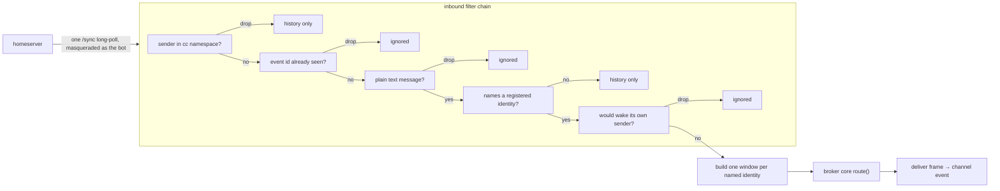

## Context

Two of the three bridge changes land before this one: a session already gets a Matrix
identity, a project space, a lobby and an epic room, and its outbound traffic is already
mirrored into the right room and thread. What is missing is everything that flows the
other way.

Today the only thing that can put a message into a session's context is another session
calling `send_message`. The broker core's `route(to, msg)` holds the whole delivery
contract: a live conn gets a `deliver` frame immediately, an unknown recipient is queued
silently, and `bus/src/handlers.ts`'s `start()` turns a delivered `ChannelMessage` into a
`notifications/claude/channel` event. `toChannelMeta` in `bus/src/message.ts` emits
exactly five identifier-safe keys. `read_history` does not exist, and the `Transport`
interface (`send`, `poll`, `watch`, `rekey`) has no read-side member at all.

This change adds the inbound half. The shape of it is deliberately narrow: **one** new hop
in front of `route()`. A human's mention becomes a `ChannelMessage` and is handed to the
same call a local send makes, so nothing downstream of `route()` needs to know Matrix
exists. Everything else here — the window, the cursor, the transcript, `read_history` — is
about deciding *what* that one `ChannelMessage` should contain.



## Goals / Non-Goals

**Goals:**

- A human mention in any `cc` room wakes exactly the named sessions, with the context they
  missed already in the payload.
- Echo loops are impossible by construction, not by a threshold or a counter.
- A session that was down when it was mentioned gets one catch-up wake, never a burst.
- A session can read any `cc` room's history on demand, and can answer a human in the
  thread the human used.
- Every behavior above is unit-testable with an injected `fetch` and an injected clock; no
  test touches a live homeserver.

**Non-Goals:**

- **The configuration layer, naming, provisioning and `bridge-state`'s internals.** They
  land before this change; here they are interfaces that get faked.
- **The outbound mirror and thread allocation.** This change *reads* the thread map to
  resolve a handle and to pick a reply target; it never creates a thread.
- **Cross-machine delivery.** Matrix is a mirror and a human seat, never the transport
  between two local sessions.
- **Rate breakers and thread brakes.** Loop safety here is structural. If a runaway ever
  happens the cheapest remedy is the operator typing in the room, and a breaker can then
  be built with real numbers rather than guessed ones.
- **Edits, redactions, reactions, media.** Plain text only.
- **A human inviting a session user into an arbitrary room.** Unsupported in v1. Session
  users are joined only by provisioning, into rooms it creates. The relay sees only the bot's
  own invites and cannot act on one addressed to a session user, so such an invite stays
  pending indefinitely. Supporting it would need an operator-gated accept path for session
  users as well, and is deferred until there is a use for it.
- **Closing the final-hop gap.** A session whose channel notifications are gated at launch
  silently drops every wake with every layer below reporting success. No layer here can
  observe that; it is a launch-flag and `doctor` problem, recorded under Risks.

## Decisions

### Seam: `Transport` gains a read side; `HandlerDeps` gains a tool. No new seam.

Two existing seams carry this change and no third is created.

- **`Transport` in `bus/src/mailbox.ts`** gains one member. `read_history` is a
  request/reply against the broker, which is exactly what the transport abstracts, and
  putting it anywhere else would give `handlers.ts` a second, parallel connection to the
  broker for no reason. **This is an interface change**, worked in the next decision.
- **`HandlerDeps` in `bus/src/handlers.ts`** gains nothing structural: `read_history`
  becomes another handler built by `createHandlers`, reading through `deps.transport`.
- **`route()` in `broker/src/broker.ts`** is *used*, not changed. The relay is a caller,
  not a new path. That is the property that keeps "one delivery path per message" true,
  and it is why a wake inherits the queueing, the re-register rebinding and the delivery
  semantics that already ship instead of restating them.

### Decision: `Transport` gains `history(req)` returning a structured result

```ts
export interface HistoryQuery {
  room?: string
  thread?: string
  since?: string
  limit?: number
  search?: string
}

export interface HistoryMessage {
  from: string
  from_id: string
  origin: 'human' | 'session'
  text: string
  at: number
  thread?: string
}

export type HistoryResult =
  | { ok: true; room: string; messages: HistoryMessage[]; more: boolean }
  | { ok: false; reason: 'unavailable' | 'not_found' }

export interface Transport {
  // …send, poll, watch, rekey unchanged…
  history(query: HistoryQuery): Promise<HistoryResult>
}
```

`HistoryResult` is a discriminated union (`type`), its members are object shapes
(`interface`) — the repo's rule, and it means the caller narrows on `ok` instead of
casting. The flat-file implementation returns `{ ok: false, reason: 'unavailable' }`
without any I/O; the socket implementation sends a `history` frame and awaits a
`history_reply`.

- *Alternative — a separate `HistoryReader` dependency on `HandlerDeps`, leaving
  `Transport` untouched:* rejected. It gives `bus` two ways to reach the broker, and the
  file/socket choice would then have to be made twice and kept in sync by hand. The whole
  point of the `Transport` seam is that one choice decides how `bus` talks to the world.
- *Alternative — reuse the existing `send`/`watch` pair with a magic recipient:* rejected.
  Request/reply smuggled through a fire-and-forget channel has no correlation id, no
  timeout story, and would be indistinguishable from a message in the inbox.
- *Alternative — have `bus` speak to Matrix directly:* rejected outright. It would put a
  credential in every session process and create a second delivery path — the exact thing
  D2 of the design brief exists to prevent.

`protocol.ts` gains `HistoryRequestFrame` / `HistoryReplyFrame` carrying a correlation id,
and `HistoryMessage` is imported from its canonical home in `bus` rather than restated, so
the wire shape cannot drift from the shape the tool returns.

### Decision: the read cursor is keyed by identity **and** room, and is an opaque token

The design brief calls it "a read cursor per identity". Writing the wake payload forces the
refinement: `unread`, `omitted` and `since` all describe one room's window, and a session
is a member of at least two rooms (its lobby and its epic room). A single per-identity
position cannot answer "what did I miss *here*" without either over-reporting (counting the
lobby's chatter into an epic wake) or silently discarding one room's backlog when the other
advances. So the store is keyed `(identity, room)`.

The value is a homeserver pagination token, carried and returned verbatim.

- *Alternative — store the last consumed `event_id`:* rejected. The history endpoint pages
  from a stream token, not an event id, so an id would have to be resolved back to a token
  on every read — an extra round trip that can fail, for no gain.
- *Alternative — store a timestamp:* rejected. Timestamps are not totally ordered across
  senders and are trivially wrong when a client's clock is off.
- *Alternative — one global cursor per identity, as the brief's table implies:* rejected
  for the reason above. The row count stays in the tens either way.

`since` is therefore opaque to the model and to `read_history`'s caller: they round-trip it
and never parse it. The specs assert round-tripping and monotonicity, never a format.

### Decision: the cursor advances when the wake is handed to a live conn

The cursor moves at exactly one moment: the wake has been routed to a session id that is
currently connected. Two consequences, both deliberate:

- **No live session ⇒ no advance.** The unread stays unread and becomes the catch-up wake
  on that identity's next register. This is what removes the need for an offline queue.
- **Live but gated ⇒ advance anyway.** If the session's channel notifications are blocked
  above the broker, the wake is consumed and lost. That is a pre-existing property of the
  local path — `route()` cannot see the gate either — and is recorded under Risks rather
  than worked around with an acknowledgement protocol this change does not need.

### Decision: one event with N mentions is processed once and fans out to N wakes

Dedupe is on `event_id` and happens *before* fan-out, so the event is considered exactly
once. Inside that single processing, each named identity gets its own window built from its
own cursor and its own `msg_id`. Identities have different backlogs; a shared payload would
be wrong for all but one of them.

Each wake's `mentions` key lists the *other* identities the same event named. That is what
lets three sessions called into one discussion notice each other and not all answer — a
cheap, purely informational key that costs a handful of tokens.

- *Alternative — one shared wake delivered to all N:* rejected. It forces one identity's
  unread window on everyone and makes `unread`/`since` meaningless for N−1 of them.
- *Alternative — dedupe per `(event_id, identity)`:* rejected. It is the same thing with a
  larger key and it invites a partial fan-out to be retried unevenly.

### Decision: the relay acts as the bot by masquerade, never as the appservice sender

Every request the relay makes — opening the sync stream, joining a room to accept an invite,
declining one, reading history — is issued with the appservice masquerade parameter naming
the configured bot user.

This is not a style preference. The homeserver refuses `/sync` for an appservice's **sender**
identity: it raises internally and answers 500. The registration therefore names an idle
sender identity that nothing ever acts as, and the bot is an ordinary user inside the
namespace that the relay masquerades as. An unmasqueraded `/sync` is a defect that fails at
runtime with a server error, which is why the spec asserts the parameter's presence in a
scenario rather than leaving it to prose that a refactor can quietly violate.

Two consequences worth naming:

- **One masquerade, everywhere.** A half-masqueraded relay — syncing as the bot but joining
  as the sender — would produce a room the stream cannot see, which reads as "the invite was
  accepted but nothing ever wakes". Keeping the parameter on every call makes that
  unconstructible.
- **The sync position belongs to the bot user.** A position is scoped to the stream that
  produced it, so a position recorded under a different bot identity is unusable, not merely
  stale. The relay treats it as absent and cold-starts, which is the safe direction: it can
  miss a pending mention, which the cursor turns into catch-up, rather than resume someone
  else's stream position and skip events it never saw.

Confirmed live against the homeserver, so neither is an assumption: a masqueraded `/sync`
for a non-sender namespace user returns 200, **including for a user with no device** — every
user in the namespace is registered with login inhibited, so none of them has one.

- *Alternative — sync as the sender identity:* not available. It is the defect this decision
  exists to avoid.
- *Alternative — give the bot a real device and an access token of its own:* rejected. It
  means a second credential to provision, store and rotate, when the appservice token already
  grants exactly this.

### Decision: the sync position is persisted *after* a batch is processed

Persisting before would make a crash mid-batch skip events permanently. Persisting after
makes an interrupted batch replay — which is harmless, because the `event_id` dedupe set is
rebuilt from nothing on a restart but the *cursor* is not: a replayed wake would be
suppressed by the read cursor having already advanced past those messages. Where the cursor
did not advance (no live session), the replay produces the catch-up the identity was owed
anyway.

The dedupe set stays in memory and bounded, evicting oldest-first. It is worthless after a
restart, and the persisted positions cover correctness — the brief's §10 already names this
split and it holds here.

### Decision: the bot accepts invites from the configured operator only

The homeserver does not auto-accept invites, and with no appservice push URL it pushes
nothing, so an invite to the bridge bot — most importantly to the operator's root space,
where the bot must add child spaces — stays pending until the bot joins. The only component
that sees it is this relay, in the `rooms.invite` section of the bot's own sync stream.

The rule: join as the bot **if and only if** the inviter is the configured operator (the
`owner` key of the Matrix configuration); decline anything else by leaving the room, which
is how the protocol rejects a pending invite. The inviter is the `sender` of the bot's own
`m.room.member` invite event in the stripped `invite_state`, compared by exact user id.
Display names are free text and are never consulted.

Why this is normative rather than a convenience: the relay wakes sessions on a mention in
any room the bot belongs to. Joining a room is therefore granting that room's members the
power to start a turn in a Claude session. Accepting any local account's invite would hand
that power to every account on the homeserver, from a room that account controls.
Federation being disabled does not help — the exposure is local accounts, not remote ones.

With no operator configured, the relay accepts nothing and declines nothing: failing closed
without destroying the invite, so the operator's pending invites are still there when the
configuration is fixed.

- *Alternative — accept every invite:* rejected. It turns room membership, which any local
  user can grant, into session control. The namespace filter would not help, because the
  attacker's own account is outside the `cc` namespace by construction.
- *Alternative — accept invites only into `cc`-namespace rooms:* rejected. The root space is
  operator-owned and outside the namespace, and it is the invite that matters most; and an
  alias says nothing about who controls the room.
- *Alternative — have provisioning join rooms explicitly and ignore invites entirely:*
  rejected. Provisioning can join rooms the bot creates, but it cannot join a room the
  operator created without the invite, and the root space is exactly that.

**Scope boundary.** The bot's sync stream carries only the bot's own invites. An invite
addressed to a session user never appears in it, so the relay does not and cannot accept
one. Session-user membership is owned by provisioning, which creates rooms as the bot and
invites and joins session users itself, leaving no pending invite behind.

**Idempotency and retry.** Acceptance keeps an in-memory set of rooms with a join in flight
or pending retry, in the relay's closure. A replayed batch finds the room already in the set
and issues no second join. A failed join stays in the set and is retried on the next sync
iteration, with backoff, until it succeeds or a later batch shows the invite withdrawn (the
room appears under `rooms.leave`). A failed join is never converted into a decline.

The retry cannot rely on the invite reappearing. An incremental sync reports a membership
change once, in the batch where it happened; since the sync position is persisted after its
batch (see the sync-position decision above), a failed join's invite is already behind the persisted
position and will not be reported again.

**Pending invites across a start — how "now" cannot skip them.** A pending invite is room
*state*, not a timeline event, and an initial sync — one with no `since` — is the protocol's
full snapshot of the account's rooms. **Confirmed live:** a pending invite does appear under
`rooms.invite` in that response, for a masqueraded sync as the bot. So on **every** start,
cold or warm, the relay first issues one reconciliation sync with no `since` and a filter
that requests an empty timeline, and handles every entry in its `rooms.invite` by the rule
above.

- On a **cold** start that same response supplies the starting position ("now"); its
  timeline is empty by filter, so nothing that predates the start is relayed.
- On a **warm** start its `next_batch` is discarded and the stream resumes from the
  persisted position, so no timeline event between the persisted position and now is lost.
  The reconciliation sync exists only to recover invites the incremental stream will never
  repeat — including a failed join whose batch was persisted past.

The spec's cold- and warm-start invite scenarios pin both paths with an injected `fetch`. A
fake `fetch` cannot prove homeserver behavior either way, so the live smoke checklist keeps
one step against the real homeserver — leave an operator invite pending, start the bridge
cold, observe the join — as a regression check on something already verified, not as an
open question.

- *Alternative — rely on the incremental stream alone:* rejected for the reason above; a
  failed join across a restart is lost permanently.
- *Alternative — persist pending invites in bridge state:* rejected. It widens a seam another
  change owns to duplicate what the homeserver already stores, and it still cannot recover an
  invite that arrived while the state file was unreadable.

### Decision: the window is inline and capped, `since` points at the pre-delivery cursor

A pull-only wake has a silent failure mode with no detector: the model answers from the one
mention line without calling `read_history`, and nothing anywhere notices the missing
context. Inlining removes the mode; the cap bounds what it costs.

The cap keeps the newest, because the mention and its immediate lead-up are what the model
is being asked about. `since` deliberately stays at the *pre-delivery* cursor even on a
truncated wake, so `read_history({ room, since })` replays the whole window including the
dropped head. Advancing `since` to the first delivered message would make the dropped
messages unreachable — the truncation would be permanent and invisible.

The waking event is exempt from the cap: a wake whose own trigger was trimmed away is
useless. `omitted` then counts everything the cap dropped, so `unread + omitted` is always
the full backlog.

### Decision: the transcript is rendered by a pure function

Window → string is pure: it takes messages, the wake's own thread, the caps and a clock
offset, and returns the transcript plus the `unread`/`omitted` counts. Keeping it pure puts
truncation, the off-thread prefix, multi-line bodies and the zero-padded clock in the
cheapest place to test thoroughly, and keeps them out of the I/O module.

Thread handles rather than raw event ids appear in the transcript for two reasons: an event
id is long enough to be a meaningful fraction of the character cap, and a handle is the
value `send_message`'s `thread` argument accepts, so what the model reads is what it can
pass back.

### Decision: the identity → session id map is re-read on every relay, never cached

This is the one place in this change with a silent-loss failure mode, and it is the same
one the repo has shipped once already. A session's id is not stable: a `--resume` launch
rewrites it and the session re-registers under the new id. `route()` queues an unknown
recipient with no log and no error, so a wake sent to a stale id returns success and is
never delivered.

The relay therefore looks the identity up at the moment it routes, against a map the broker
rebinds on every `register` frame. No memoisation, no snapshot taken when the sync loop
started. The spec carries an explicit re-register scenario so a future refactor that adds a
cache fails a test rather than a user.

Nothing in this change writes a presence beacon or changes what a session subscribes to, so
the beacon/subscription pairing rule is untouched — but the *reason* that rule exists is the
same one driving this decision.

### Decision: a Matrix-addressed `to` bypasses local resolution entirely

`send_message`'s `to` is classified before `resolveTo` runs: a value that parses as a Matrix
user id **outside** the `cc` namespace is a Matrix-only post. A `cc`-namespace value is not
— those are sessions, and they are reached locally.

The destination is the room and thread of that person's most recent mention of this session.
That default is what keeps a session pulled into a discussion answering *in* the discussion
rather than shouting into its epic room. A remembered room the session no longer belongs to
falls back to its own room, which enforces "write only where you are a member" without a
separate permission check.

### Decision: Testing Strategy

**Pure, tested exhaustively, no fakes needed:**

- `matrix-relay-filter.ts` — the filter chain as a predicate over an already-parsed event
  plus the registered-identity set. Namespace drop, dedupe, non-text drop, self-wake drop.
- `matrix-window.ts` — window selection, both caps, `unread`/`omitted` arithmetic, the
  waking-event exemption, and the transcript render (line shape, zero-padding, display-name
  fallback, off-thread prefix, multi-line bodies, no event ids).
- The meta mapping extension in `bus/src/message.ts` — origin-conditional keys, string
  values, omitted thread keys, `mentions` excluding self.

**Faked at the boundary:**

- **`fetch`** — injected into the Matrix client the relay uses. Sync batches are handed to
  the loop as canned responses; assertions are on the request's `since` parameter, on the
  masquerade parameter being present and naming the configured bot user on **every** request
  the relay makes, and on what reaches `route()`.
- **`route()`** — a spy. Every wake assertion is "these calls, with these payloads",
  which is directly executable and does not require reading a log.
- **`BridgeState`** — a real implementation over a temp directory for the atomicity and
  tolerant-read cases, and an in-memory fake elsewhere.
- **Clock** — injected, so `[14:02]` is deterministic.

**Files added or extended:**

| File | Kind | Covers |
| --- | --- | --- |
| `broker/src/matrix-relay.ts` + `.test.ts` | new | sync loop, resume, cold start, fan-out, cursor advance, catch-up on register |
| `broker/src/matrix-relay-filter.ts` + `.test.ts` | new | the filter chain, bounded dedupe |
| `broker/src/matrix-invites.ts` + `.test.ts` | new | operator-only invite decision (pure), join/decline/retry bookkeeping, reconciliation on cold and warm start |
| `broker/src/matrix-window.ts` + `.test.ts` | new | window selection, caps, transcript render |
| `broker/src/matrix-history.ts` + `.test.ts` | new | `read_history` resolution: defaults, cross-room read, `since`, `limit`, `search`, `not_found` |
| `broker/src/protocol.test.ts` | extended | history request/reply frames round-trip and decode |
| `broker/src/broker.test.ts` | extended | a relayed wake goes through `route()`; a re-registered session is routed to its new id |
| `bus/src/message.test.ts` | extended | the widened meta mapping |
| `bus/src/handlers.test.ts` | extended | `read_history` handler, Matrix-addressed `send_message`, the unavailable paths |
| `bus/src/mailbox.test.ts` | extended | the file transport answers `unavailable` without I/O |
| `bus/src/socket-transport.test.ts` | extended | `history` round-trips over the socket |

Every new module follows factory-plus-closure: `createMatrixRelay(deps)` owns the dedupe
set, the in-flight sync handle and the cursor writes in its closure, so each test builds its
own and vitest's lack of module-state reset between cases cannot leak.

**No test touches a live homeserver.** Live verification is a manual smoke target and the
`doctor` checks, both out of scope here.

## Risks / Trade-offs

- **A woken session whose channel notifications are gated loses the wake silently.** The
  cursor advances, the broker reports success, and no layer can observe the drop. →
  Mitigation is outside this change: a launch alias that always passes the flag, and a
  `doctor` check for the gate line. This change does not pretend to detect it, and the
  at-most-once boundary is stated in the proposal rather than buried.
- **A mention aimed at a dead identity is invisible until that identity comes back.** →
  Intentional: the cursor turns it into a catch-up wake. The operator sees no
  acknowledgement in the meantime, which is the same experience as messaging a person whose
  phone is off.
- **A crash between routing a wake and persisting the advanced cursor re-delivers it.** →
  Accepted. The cost is one duplicated wake; the alternative (persist first) costs a
  permanently lost one. At-least-once is the right side of that trade for a context
  injection.
- **The character cap is measured on the rendered transcript, not on tokens.** A window of
  CJK text carries more tokens per character than English. → Accepted for v1; the cap is
  configuration, so it can be lowered without a code change.
- **An operator can wake many sessions at once with a room-wide mention.** → Bounded by
  design: only registered members of that room, never transitively, and the operator is the
  only human in the room. A breaker is explicitly deferred until there is a real incident to
  size it against.
- **`Transport` grows a member, so any future implementation must provide `history`.** →
  Accepted and cheap: `{ ok: false, reason: 'unavailable' }` is a complete, correct
  implementation for a transport with no bridge, which is what the flat-file one returns.
- **An operator account compromise is a session compromise.** Any room the operator
  invites the bot into becomes a room whose members can wake sessions. → Accepted: the
  operator already controls every session directly. The rule narrows the exposure from
  "every local account" to "the one account that already has it".
- **A declined invite is gone.** If the operator's own invite is ever declined — for
  example because the configured operator id has a typo — they must re-invite once the
  configuration is fixed. → Mitigated by failing closed *without* declining when no operator
  is configured; a wrongly configured one still declines, and the configuration diagnostics
  are where that shows up.
- **The relay's identity is the appservice token plus a masquerade parameter, not a
  session.** A configuration that names a bot user outside the appservice namespace produces
  a rejection on every call rather than a partial failure. → Accepted and preferred: it fails
  immediately and visibly at start-up instead of degrading silently.
- **A room that turns out to be encrypted is unreadable.** → Skip that room, keep the rest
  of the loop running. It never becomes a bridge-wide fault.
- **An unhandled rejection anywhere in the relay would exit the broker** through the
  process-level backstop, turning a homeserver hiccup into a supervised restart. → Every
  async path in the relay carries its own handler and returns errors across the boundary
  instead of throwing. The relay never calls the fatal guard.

## Migration Plan

No data migration and no on-disk format change beyond new keys in the bridge state file,
which is read tolerantly and treats anything it cannot parse as absent. An older broker
reading a newer state file ignores the cursor rows it does not know; a newer broker reading
an older file starts those identities at "now".

Rollout is a restart. Rollback is disabling the bridge in configuration: `read_history`
and Matrix-addressed sends then answer `unavailable`, and local session-to-session
messaging is bit-for-bit what it is today. The widened channel meta is the only change
visible with the bridge off — `origin` appears on every message — and it is additive, so
nothing that reads the existing keys breaks.

## Open Questions

- **`unread` when a window spans a room's main timeline and its threads.** Resolved here as
  "count every unread message in the room regardless of thread, and prefix off-thread lines
  with their handle", because the cursor is per room and splitting it per thread would
  multiply the row count by the thread count for no gain. If threads turn out to be busy
  enough that a wake is mostly other people's threads, the alternative is a per-thread
  cursor and it should be revisited with real volumes.
- **Whether `role` should gain a `human` member** instead of reporting `none` for a human
  sender. `origin` already distinguishes them and widening the role union touches the
  identity types this change otherwise leaves alone, so `none` it is — but it does mean
  `role` alone no longer implies "a session sent this".
- **Whether the character cap should be token-aware.** Deferred until there is a reason
  beyond neatness; the cap is configuration.
- **Whether a catch-up wake should be produced per room or one combined wake.** Per room
  here, because a wake names exactly one `room` and one window. A session that missed
  mentions in both its lobby and its epic room therefore gets two wakes on register. If that
  proves noisy, combining them needs a meta shape that can carry two windows, which is a
  bigger change than it looks.
