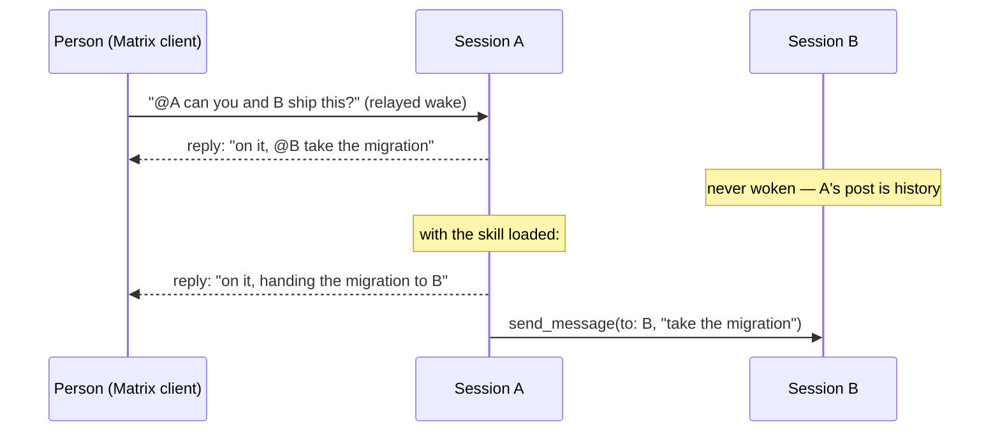

## Context

The bus already behaves as intended. A session wakes a peer only through `send_message` with
that peer in `to`. The broker routes it, and the mirror posts it to the room with the
recipients mentioned. A session's own room post is history: the inbound filter drops namespace
senders, which is what keeps echo loops impossible. A reply to a person mentions that person
only.

What was missing is that sessions were never told this. The MCP instructions are the only
guidance a session gets, and their closing line, "Mention someone by their name in the room to
reach them", reads to a session like an instruction to `@`-name peers in its replies.



This change teaches the rule, and changes no behaviour.

## Goals / Non-Goals

**Goals:**

- Installing sessionbus puts the guidance in front of every session on the machine.
- The guidance tracks the repo, so an edit to a skill reaches every session on the next pull.
- The install never destroys a user's own skills.

**Non-Goals:**

- Any change under `bus/src` or `broker/src`, including rewording the MCP instructions. The
  skill resolves the ambiguous line instead of editing it.
- Runtime detection of unwoken mentions. It was considered and dropped: the code is correct,
  and the gap is knowledge.
- Packaging as a Claude Code plugin. The layout below is chosen so that step is a move of
  nothing (see D1).

## Decisions

### D1. Skills live at `skills/<name>/SKILL.md` at the repo root

`.claude/skills/` already holds this repo's contributor skills (the OpenSpec ones). Those must
not leak into every session on the machine, so the shipped skills get their own directory.
`skills/<name>/SKILL.md` is the layout a Claude Code plugin uses, so a future plugin that bundles
the MCP server can include these skills as they are.

The directory is plural on purpose. The installer links every `skills/*/` that has a
`SKILL.md`, so a second skill later needs no Makefile change.

*Alternative considered:* a single `SKILL.md` next to `bus/`. Rejected, because it would not
match the plugin layout and would not scale to a second skill.

### D2. One skill, `sessionbus`, for now

The mistake crosses both halves of the system: a person's relayed wake leads to a hand-off to a
peer. Splitting the guidance into a "peers" skill and a "rooms" skill would teach each half in
isolation and miss the hand-off, which is exactly where sessions fail. The skill is split
later only if it grows past a comfortable single read.

Content, action-first, written with `superpowers:writing-skills` discipline (the description is
trigger conditions only):

1. **The wake rule.**
2. **Addressing:** a peer takes a short id, name, `pm`, `epic`, or a list; a person takes their
   full Matrix id from `from_id`. A mixed audience needs two calls.
3. **Answering a relayed wake:** reply to the person where they asked. For each peer being
   involved, also call `send_message`, and tell the person you did.
4. **What the MCP instructions' "mention someone by name" means:** it is how a person in a
   client reaches you. Writing `@name` yourself does nothing.
5. **`read_history`:** it catches up on `omitted` messages, or on how another room solved
   something. It notifies nobody.
6. **Self-check before ending a turn:** "Did everyone I need to act get a `send_message` with
   them in `to`?"

### D3. Install as a symlink, from the Makefile, hooked onto `mcp-add`

"Installing the MCP" in this repo means `make mcp-add` (run by `make setup`). Hooking the skills
there is what makes them arrive with the server:

```make
SKILLS_SRC := $(ROOT)/skills
SKILLS_DIR ?= $(HOME)/.claude/skills

mcp-add: config-seed mcp-remove skills-install
	claude mcp add $(MCP_NAME) -s user -- node $(BUS_ENTRY)

teardown: …
	@$(MAKE) --no-print-directory skills-uninstall
```

`skills-install` loops over `$(SKILLS_SRC)/*/SKILL.md`. For each skill it checks the target
path in order:

1. `[ -L ]` and `readlink` equals the source: already installed.
2. `[ -e ] || [ -L ]`: conflict. It records the path and continues.
3. Otherwise: `ln -s <abs source> <target>`.

It exits non-zero if any skill conflicted. `skills-uninstall` removes a path only when rule 1
holds, and reports anything else it finds there.

- *Symlink vs. copy:* a copy goes stale on `git pull`. The MCP registration already points
  `node` at this checkout's absolute path, so a link adds no coupling the install does not
  already have.
- *Hook on `mcp-add` vs. only `setup`:* the stated intent is "when I install the MCP it brings
  the instructions". `mcp-add` is the narrowest target that means that.
- *`mcp-remove` does not uninstall the skills.* `mcp-add` runs `mcp-remove` first, so hooking
  the uninstall there would churn the links on every re-registration. Removal belongs to
  `teardown`.
- *Makefile shell vs. a TypeScript installer:* the ownership checks are three `test`s and a
  `readlink`. A script module would add product code the change explicitly does not want.

### D4. Testing strategy

No TypeScript changes, so there are no new `*.test.ts` files and the package suites must stay
unchanged. This is a deliberate exception to the "scenarios directly executable as vitest"
rule. The subjects are a Markdown file and Makefile targets, neither of which has a module to
test.

Verification is:

- **Installer:** each spec scenario is run by hand as a `make … SKILLS_DIR=$(mktemp -d)`
  command, with `ls -l` / `readlink` checks. The commands are listed verbatim in `tasks.md`, so
  anyone can repeat them, and no run touches the real `~/.claude/skills`.
- **Skill content:** the spec's content scenarios are checked by reading the file. The
  behavioural check uses the writing-skills pressure test. A fresh session with the skill
  loaded gets a relayed-wake prompt asking it to involve a peer, and it must call
  `send_message` for that peer rather than only `@`-naming it.
- **Regression:** `pnpm lint` and both packages' `pnpm test` pass with unchanged counts.

## Risks / Trade-offs

- **[The skill does not trigger]** → The description names the `<channel source="sessionbus">`
  event explicitly, and the pressure test in the tasks checks that it triggers. If triggering
  proves unreliable, the fallback is a one-line pointer in the MCP instructions, which would
  need a separate, code-touching change.
- **[The skill and the MCP instructions contradict each other]** → The skill addresses the
  ambiguous line head-on rather than ignoring it, so a session holding both reads them as
  consistent.
- **[A moved checkout leaves dangling links]** → The same failure mode the MCP registration
  already has. Re-running `make setup` reports a conflict naming the stale link, and the user
  removes it.
- **[The user already has a `sessionbus` skill]** → The installer refuses and exits non-zero,
  and never overwrites it.

## Migration Plan

Additive. Existing installs get the skill by running `make mcp-add` or `make setup` again (or
`make skills-install` directly). Rollback is `make skills-uninstall`. No state, wire-format or
code changes.

## Open Questions

- Package sessionbus as a Claude Code plugin (MCP server + `skills/`) so that
  `claude plugin install` does all of this. It is deferred because the plugin form renames the
  server, which changes the `--dangerously-load-development-channels server:sessionbus` launch
  flag. That needs its own change.
